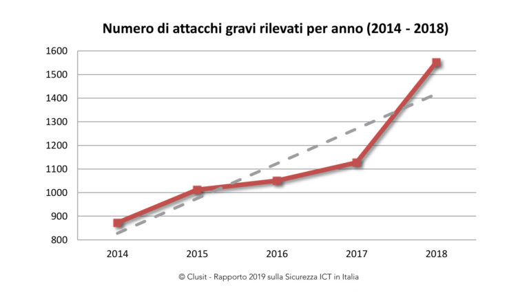
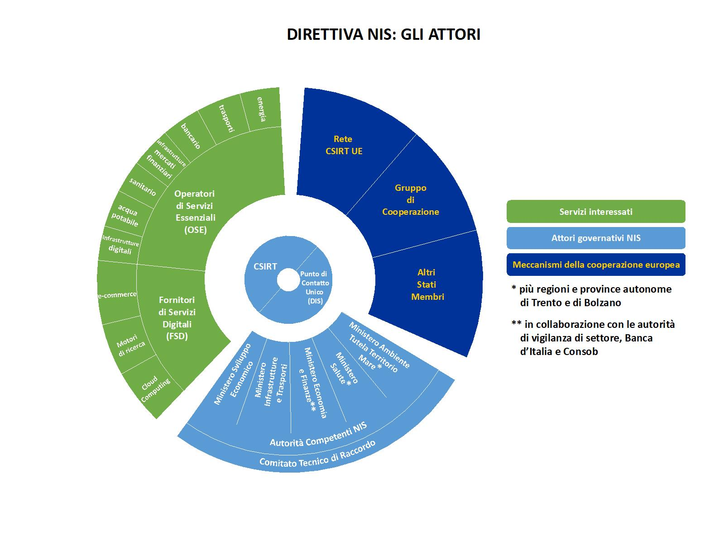

=====================
Analisi Organizzativa
=====================

In questo sezione analizzeremo gli aspetti organizzativi che riguardano
il Project Work in oggetto con l’obbiettivo di far emergere opportunità
ed eventuali problematiche che potremmo incontrare nel corso del
progetto ed eventuali soluzioni che si potrebbero applicare.

Ambiente Esterno
----------------

Negli ultimi anni gli attacchi informatici sono sempre meglio
strutturati ed efficaci.

Dal 2000 ad oggi il CLUSIT (Associazione Italiana per la Sicurezza
Informatica) presenta annualmente un rapporto sulle minacce informatiche
che sono avvenute facendo emergere una situazione sempre più critica
sulla capacità delle organizzazioni criminali di poter aggirare e
attaccare infrastrutture informatiche non adeguatamente protette.

In questo modo possono farne uso per i più disparati scopi:
dall’attivismo alla vendita di dati recuperati da queste azioni, fino a
creare dei veri e propri disservizi dei sistemi informativi che possono
portare a bloccare intere aziende nella loro normale operatività con
ingenti perdite economiche, di immagine e di produttività delle stesse.

|image1|\ Nel grafo è riportato l’andamento degli ultimi sei anni e di
come questo fenomeno stia aumentando.

Questo fenomeno è naturalmente esteso a livello internazionale in tutte
quelle nazioni che ad oggi presentano un minimo livello di
digitalizzazione.

Ci soffermeremo nel descrivere la situazione Europea attuale in modo da
capire esattamente cosa è stato fatto e cosa si sta facendo a tale
proposito.

La Comunità Europea ha approvato nel 2016 la **Direttiva NIS 2016/1148**
(*Network and Information Security*) che è volta a stabilire le misure
per la realizzazione in Europa di un ambiente digitale sicuro e
affidabile.

E' stata recepita col Decreto Legislativo 18 maggio 2018, n. 65,
pubblicato sulla Gazzetta Ufficiale n. 132 del 9 giugno 2018 (entrato in
vigore il 24 giugno 2018).

La Direttiva impone agli Stati Membri dell'Unione europea l'adozione di
una serie di misure di sicurezza comuni ed adeguate, imponendo nel
contempo la notifica degli incidenti all'Autorità nazionale istituita
allo scopo.

Gli Stati dovranno anche promuovere la nascita di CSIRT (**Computer
Security Incident Response Team**) nazionali, sulla base del CERT-UE,
per realizzare un network europeo che si occupi della sicurezza delle
reti critiche.

Gli obiettivi sono, quindi:

-  gestione dei rischi di sicurezza;
-  protezione contro i cyber attacchi;
-  individuazione di incidenti di cyber sicurezza;
-  riduzione dell'impatto degli incidenti di cyber sicurezza.

La Direttiva NIS, e il decreto di attuazione, si rivolgono a due
categorie:

-  **Operatori di servizi essenziali**\ (OES) stabiliti nell'Unione
   europea, cioè i soggetti, pubblici o privati, che forniscono servizi
   essenziali per la società e l'economia nei settori sanitario,
   dell'energia, dei trasporti, bancario, delle infrastrutture dei
   mercati finanziari, della fornitura e distribuzione di acqua potabile
   e delle infrastrutture digitali;
-  **Digital Service Provide**\ r (DSP), cioè le persone giuridiche che
   forniscono servizi della società dell'informazione (e-commerce,
   social network, cloud computing, motori di ricerca, financial
   provider, ecc...); le persone giuridiche che forniscono servizi di
   e-commerce, cloud computing o motori di ricerca, con stabilimento
   principale, sede sociale o rappresentante designato sul territorio
   nazionale.
   Non sono soggetti alla normativa i DSP con meno di 50 dipendenti o
   con fatturato inferiore ai 10 milioni l'anno (piccole e micro
   imprese).

Si tratta di soggetti che sono essenziali per la vita di tutti i giorni
dei cittadini dell’Unione. A tali soggetti la direttiva impone specifici
oneri:

-  **adozione di misure tecniche e organizzative** adeguate alle
   gestione dei rischi e a prevenire e minimizzare l'impatto degli
   incidenti di sicurezza delle reti e dei sistemi informativi, al fine
   di assicurare la continuità del servizio;
-  **obbligo di notifica**, senza ingiustificato ritardo, degli
   incidenti di sicurezza con impatto rilevante, rispettivamente sulla
   continuità e la fornitura del servizio.

La notifica va fatta al **Computer Security Incident Response
Team**\ (CSIRT) italiano, informandone anche l’Autorità competente NIS
di riferimento.

Il CSIRT italiano è istituito presso la Presidenza del Consiglio dei
Ministri mediante unificazione del Computer Emergency Response Team
(CERT) Nazionale e del CERT-PA. Si occupa di:

-  definire le procedure per la prevenzione e la gestione degli
   incidenti informatici;

-  ricevere le notifiche di incidente, informandone il **DIS
   (Dipartimento informazioni per la sicurezza)**\ che coordina i
   servizi segreti:

   -  fornire al notificante le informazioni utili per le gestione
      efficace dell’incidente;
   -  informare gli altri Stati membri dell’UE eventualmente coinvolti
      dall’incidente, tutelando la sicurezza e gli interessi commerciali
      dell’OSE o del FSD nonché la riservatezza delle informazioni
      fornite.

Inoltre la Commissione Europea ha fissato i criteri e le soglie per
stabilire la **rilevanza degli incidenti** da parte dei DSP.

Un incidente è rilevante se si verifica almeno una condizione:

-  indisponibilità del servizio fornito per oltre 5.000.000 di ore
   utente;
-  perdita di integrità, autenticità o riservatezza dei dati per oltre
   100.000 utenti dell’UE;
-  rischio per la sicurezza e/o l’incolumità pubblica, o in termini di
   perdite di vite umane;
-  danni materiali superiori a 1.000.000 di EUR per almeno un utente
   nell’UE.

Il recepimento in Italia della Direttiva NIS può essere riassunta in
questo diagramma:

|image2|

Diversi aspetti di questa Direttiva risultano rilevanti al mantenimento
delle infrastrutture, dei servizi informatici, in particolare:

-  **notifica degli incidenti informatici**: **gli operatori di servizi
   essenziali dovranno inoltrare al CSIRT** (e per conoscenza all’
   autorità competente NIS del proprio settore) **le** **notifiche di
   incidenti informatici**\ con impatto rilevante sui servizi forniti,
   Il decreto non fissa un limite temporale rigido per le notifiche, ma
   specifica che le stesse vanno effettuate “senza ingiustificato
   ritardo”;
-  **trattamento dei dati personali:** il decreto attuativo precisa che
   il trattamento dei dati personali in applicazione del decreto sia
   effettuato ai sensi del D.Lgs. 196/2003. Tale riferimento è diventato
   (almeno in parte) obsoleto con l’entrata in vigore definitiva del
   Regolazione Generale sulla protezione dei dati (GDPR);
-  **regime sanzionatorio:**\ la Direttiva NIS lascia agli Stati membri
   un margine di discrezionalità riguardo al tipo e alla natura delle
   sanzioni applicabili, a condizione che siano effettive, proporzionate
   e dissuasive. Nell’esercitare tale discrezionalità, il governo ha
   ritenuto di stabilire che le autorità competenti potranno applicare
   sanzioni amministrative fino a 150.000 Euro.

Per quanto riguarda il regime sanzionatorio è necessario aggiungere alla
sanzione prevista dalla Direttiva NIS quella introdotta dal GDPR che può
prevedere **m\ ulte** che potranno arrivare **fino a 20 milioni** di
euro e saranno pari al **2% o al 4% del fatturato** per le imprese.

Da questa prima esamina di quello che ad oggi lo scenario rivolto
all’argomento della sicurezza informatica fa emergere diversi aspetti
interessanti da affrontare e approfondire.

Sicuramente questi aspetti necessitano di tempi medio/lunghi per essere
elaborati e devono permeare all’interno della società per accrescere la
cultura generale sotto questi aspetti. La nostra società ci permette di
avere servizi sempre più efficienti ed efficaci ma questo non può
diminuire la l’affidabilità e la certezza che certe operazioni critiche
non vadano a buon fine. Quindi è necessario che i sistemi informativi
forniscano servizi agli utenti sempre più efficienti e sicuri.

E’ necessario quindi, oltre ad investimenti ingenti per migliorare i
sistemi informativi ed infrastrutture, aumentare la cultura generale in
modo da prevenire eventuali problemi e diverrà fondamentale intervenire
in tempi utili riducendo i tempi di notifica prevista dalla Direttiva
NIS.

L’aspetto normativo non è l’unico che è necessario considerare per
affrontare la seguente problematica della sicurezza informatica.

Un altro aspetto importante è la razionalizzazione dei data center
pubblici.

Il processo è distinto in tre fasi ben distinte che hanno avuto inizio
nel 2017 con la pubblicazione da parte dell’Agenzia per l’Italia
Digitale della circolare n. 5 del 30 novembre 2017.

La finalità di questo censimento era\ **l’individuazione delle
infrastrutture candidate a ricoprire il ruolo di PSN** (Poli Strategici
Nazionali) o classificabili nelle categorie:

-  nel Gruppo A rientreranno le amministrazioni che dispongono di data
   center di **qualità intermedia**;
-  nel Gruppo B rientreranno le amministrazioni con\ **infrastrutture
   carenti**;
-  nella categoria candidabile a Polo strategico nazionale (PSN) saranno
   inseriti i **soggetti con data center caratterizzati da elevati
   standard di qualità**.

Con la conclusione della seconda fase, avvenuta il 20 giugno 2018, ha
visto la partecipazione di:

-  778 Amministrazioni,
-  625 amministrazioni hanno dichiarato di possedere Data Center
-  153 amministrazioni hanno dichiarato di non possedere oppure di
   avvalersi di servizi IT erogati da altri soggetti
-  4154 applicazioni critiche

Per un totale di 927 Data Center censiti.

Dal 14 giugno 2019 sta procedendo la Fase 3 del Censimento del
Patrimonio ICT della PA\ **che\ si propone di rilevare i dati necessari
per delineare il quadro informativo/statistico sulle principali
installazioni informatiche a livello nazionale, regionale e locale**,
raccogliendo informazioni circa l’insieme delle principali componenti
hardware e software in uso dalle amministrazioni pubbliche.

Come previsto dalla nuova Circolare AGID n. 1/2019 pubblicata in
Gazzetta Ufficiale (GU Serie Generale n. 152 del 01 luglio 2019) e con
riferimento ai **requisiti** riportati nella tabella dell’Allegato A
della stessa Circolare, ogni singola infrastruttura quindi potrà essere
classificata in una delle seguenti categorie:

-  **Infrastrutture candidabili all’utilizzo da parte di un PSN**, se
   soddisfa tutti i requisiti riportati nella colonna Candidabilità
   all’uso da PSN;
-  **Gruppo A**, se non soddisfa tutti i requisiti riportati nella
   colonna Candidabilità all’uso da PSN ma soddisfa tutti i requisiti
   riportati nella colonna Gruppo A;
-  **Gruppo B**, se non soddisfa i requisiti di cui alle categorie
   precedenti e nel caso di mancata partecipazione alla rilevazione.

Queste fasi e questi cambiamenti fanno parte del **piano triennale per
la pubblica amministrazione 2019 – 2021**\ che indica le linee di azione
per promuovere la trasformazione digitale del settore pubblico e del
Paese.

In questo scenario e nell’attuale processo di trasformazione che sta
avvenendo si possono notare aspetti di forte miglioramento ma anche di
forte responsabilizzazione per strutture informatiche che rispondano ai
requisiti richiesti.

Questo comporterà un’attenzione maggiore verso questi PSN che possiamo
semplificare in due aspetti coerenti al Project Work che stiamo
affrontando:

1. **Economico:** dovuto alla riduzione e semplificazione dell’attuale
   scenario dei data center in Italia che permetterà alle PA italiane di
   ridurre i costi di gestione di data center piccoli e non adeguati.
2. **Sicurezza**: pochi e ben strutturati PSN porteranno a un maggior
   controllo e ridurranno il perimetro migliorandone l’efficacia delle
   protezioni messe in atto.

In questo scenario ricco di cambiamenti e miglioramenti il Project Work
vuole avere un suo ruolo fondamentale: quello di aggregare, correlare e
trasmettere informazioni di attacchi informatici che possono interessare
gli attori coinvolti in questo cambiamento.

In questo contesto tutti gli stakeholder sarebbero parte attiva e
contribuirebbero a mitigare eventuali situazioni critiche che si
potrebbero presentare in ogni instante della normale operatività dei
servizi forniti dalla PA verso i concittadini.

Ad oggi questa operazione è fornita, come dicevamo in precedenza, dal
CERT e CERT-PA con un meccanismo di notifica efficace ed efficiente ma
non sufficientemente celere a bloccare situazioni critiche in atto.

Se consideriamo il fatto che in ogni istante del giorno un attacco
informatico può mettere in crisi le infrastrutture portando alla
paralisi dell’intero data center si ritiene necessario migliorare
l’aspetto di comunicazione tra i vari attori per avere una difesa
globale più efficace, riducendo drasticamente i tempi di comunicazione e
quindi di reazione di tutti i partecipanti.

Ambiente Interno
----------------

Lo scenario che si è presentato finora fa emergere aspetti organizzativi
interessanti e ha delineato cosa può essere considerato come ambiente
esterno e quali possono essere i punti di forza del Project Work e
delinea un ambiente interno molto interessante legato al fatto che tutti
i punti affrontati sono di sicuro interesse da parte di tutti gli attori
che potrebbero essere coinvolti e che potrebbero presentare alcune
caratteristiche particolari anche sotto questo punto di vista.

Uno degli aspetti che emergono con maggiore determinazione è quello
della Community: attori differenti che hanno interessi comuni e
problematiche comuni da affrontare.

Questo aspetto è necessario che venga mantenuto nel tempo ed è
fondamentale che l’interesse e la partecipazione si mantenga almeno
costante nel tempo in modo da permettere uno scambio continuo di idee,
problematiche, metodi di azioni.

La Community è, su questo Project Work, uno degli aspetti fondamentali
perché possa avere successo nel tempo. Questo aspetto dovrà essere
mantenuto arricchendolo di vari contributi che arriveranno all’interno
del gruppo fornendo la giusta visibilità da parte di chi ha fornito
notizia, di chi lo dovrà recepire ed analizzare ed un adeguato ritorno
positivo o negativo sul contributo fornito.

Questo modo potrebbe portare ad una maggiore coesione all’interno della
Community e maggior appartenenza con l’effetto sperato del non
abbandono.

Analizzando i possibili attori della Community è possibile individuare
Enti Nazionali ben distinti che possono portare il loro contributo alla
riuscita del progetto, ad esempio: PSN, Ministero dell’informazione,
Agid, CERT, CERT-PA, Polizia Postale di Stato.

Da questo breve elenco, che non vuole considerarsi esaustivo, emerge una
situazione molto eterogenea di come questi attori sono strutturati al
loro interno e nei loro processi, e si rende necessario quindi pensare
ad un modello di governo dell’intero Project Work che non abbia la
presunzione di entrare nel merito di ogni singola realtà ma che possa
portare a termine gli obiettivi preposti mantenendo il più possibile la
coerenza con le modalità esistenti ad oggi all’interno della singola
struttura.

Per la grande maggioranza tutti gli attori della Community avranno una
propria struttura non solo organizzativa, di processo ma anche di propri
sistemi informativi che ad oggi li supportino nelle loro attività.

Struttura Organizzativa
-----------------------

Una struttura divisionale integrata è di fatto lo schema classico che
più si addice a questa analisi di contesto:

-  **Azienda**: parliamo dell’intera Nazione coinvolta e di fatto
   potremmo considerare come una sola e grande azienda;
-  **Ambiente**: visti i cambiamenti in atto possiamo considerare
   l’ambiente dinamico e complesso;
-  **Raggruppamento**: sicuramente una specializzazione degli output
   forniti e insita all’interno della struttura coinvolta;
-  **Livelli gerarchici**: saranno previsti quattro livelli gerarchici:
   Direzione Generale, Direzione di business; Direzioni di funzioni;
   Unità operative.
-  **Accentramento/Decentramento**: è necessario un’autonomia e delega
   totale alle direzioni di Business e un accentramento al vertice per
   decisioni strategiche e allocazioni di risorse.
-  **Formalizzazione**: è di fatto molto sviluppata all’interno delle
   divisioni ma sarà necessario spostare questo aspetto anche a livelli
   più alti per aumentare e mantenere uno standard qualitativo molto
   alto.
-  **Organi di staff:** necessario maggiori approfondimenti.
-  **Sistemi Operativi**: sarà necessario sviluppare un sistema
   informativo per mantenere un coordinamento sulle attività.

I punti di forza di questa struttura sono sicuramente: la gestione
integrata e unitaria del business, una maggior rapidità dei processi
decisionali e una maggior risposta ai cambiamenti in un ambiente in
continua evoluzione coadiuvata da una flessibilità strategica nella
definizione del business.

I punti deboli su cui sarà necessario intervenire con maggior controllo
potrebbero essere quello dell’orientamento all’efficienza che però
potrebbero essere irrisori nel caso di molta coesione e partecipazione
della Community.

Gli altri punti di debolezza che si potrebbero presentare con questa
tipo di struttura, sono:

-  Perdita di economia di scala e di specializzazione
-  Rivalità conflittualità inter-divisionali
-  Eccessivo orientamento al raggiungimento di performance di breve
   periodo

Sono da considerarsi poco rilevanti per come questo progetto dovrà
portare a compimento il risultato previsto. L’ambiente infatti non è
assolutamente quello di una grande azienda orientata agli utili ma sarà
quello di mettere a fattor comune l’esperienza di tutti gli attori per
un obiettivo comune e, quindi, i tre aspetti sopra elencati possono
essere per il momento considerati come non critici.

Uno degli aspetti critici che invece dovranno essere tenuti sotto
controllo e sicuramente l’aspetto del coordinamento che dovrà
preoccuparsi di mantenere viva la Community, suddividendo i compiti e le
attività tra gli attori coinvolti definendo processi idonei sia in fase
di raccolta requisiti che di realizzazione di un Security Information
and Event Management (SIEM) a livello nazionale.

Una rappresentazione iniziale dell’organigramma aziendale è riportata
nel grafico sottostante:

|image3|

.. _section-1:

.. _section-2:

.. _section-3:

Mission
-------

Il project work ha come obbiettivo l’integrazione di eventi di sicurezza
che ogni infrastruttura partecipante al progetto possa fornire
permettendo così che ogni attore diventi fornitore dei propri eventi che
potranno essere consumati dagli attori restanti. Questo permetterà un
accrescimento da parte di tutti sull’apprendimento e sulle modalità di
gestione di eventi critici creando una base di conoscenza noto a tutti e
porterà alla definizione di standard comportamentali per la risoluzione
di problematiche legate al mondo della cybersecurity.

Sarà necessario sviluppare una sovra infrastruttura il cui scopo
principale sarà quello di armonizzare e velocizzare la comunicazione tra
gli attori condividendo gli eventi critici per renderli immediatamente
utili ai partecipanti.

Questa infrastruttura vuole migliorare alcune problematiche che
riguarderanno in particolare:

-  incrementare l’efficacia delle comunicazioni tra strutture critiche;
-  incremento della conoscenza sulla sicurezza informatica;
-  armonizzazione di processi tra enti;
-  abbattimento di costi nel gestire problematiche di sicurezza
   informatiche;
-  permettere agli attori di diventare parti attive nell’individuazione
   e risoluzione di aspetti di sicurezza informatica;
-  confrontarsi con altre realtà per capire come risolvere una nuova
   problematica e condividerla.

Strategia corporate
~~~~~~~~~~~~~~~~~~~

La quasi totalità delle aziende nazionali, per il momento possiamo
limitarci al nostro perimetro ma in realtà potremmo tranquillamente
estenderlo a quelle internazionali, stanno approcciando il problema
della sicurezza informatica con grande apprensione e ancor poca
dimestichezza.

E’ continua la ricerca di personale specializzato in questo ambito così
vasto e in continua crescita. Sicuramente argomenti così impattanti e
con poca cultura sono di grande preoccupazione per tutte le aziende che
trattano prodotti e servizi basati su sistemi informativi.

Sia per etica aziendale che per effetto di ingenti multe si rende
necessario adeguare la propria infrastruttura e limitare quanto più
possibile i danni che potrebbero essere causati da un eventuale attacco
informatico.

Il settore in cui andiamo ad operare è di fatto un settore dove la
richiesta di protezione è alta e quindi l’interesse è elevato.

Essendo un argomento di interesse comune sarà necessario veicolare e
promuovere l’iniziativa verso la più ampia platea possibile.

Strategia di business
~~~~~~~~~~~~~~~~~~~~~

Il coinvolgimento di un’ampia platea darà la possibilità di recepire la
maggior parte di casi d’uso possibile che permetteranno di creare uno
strumento informatico atto a coprire la le esigenze raccolte.

La creazione di un Sistema Informativo Open Source atto a raccogliere e
condividere problematiche sull’argomento, porterà diversi vantaggi:

-  condivisione della conoscenza sull’argomento;
-  condivisione di risorse umane;
-  condivisione di obbiettivi comuni;
-  riduzione di costi;
-  standardizzazione di processi complessi;

Su questi punti è necessario elaborare una strategia che mantenga nel
lungo periodo la possibilità di mantenere il progetto dal punto di vista
di esigenze, performance e interesse.

Si dovrà puntare alla formazione e al supporto nell’uso e installazione
del sistema informativo e proporre servizi di controllo e monitoraggio
in caso in cui si abbia a che fare con un cliente finale che abbia
necessità di essere protetto ma non abbia personale preparato o adeguato
a farlo.

Essendo di interesse nazionale andrà vagliata la possibilità di avere
incentivi statali o condizioni di sottoscrizione, utili a mantenere nel
tempo la Community, le infrastrutture e il software necessario a gestire
questo progetto.

Strategia funzionale
~~~~~~~~~~~~~~~~~~~~

Essendo l’argomento e l’ambiente esterno molto complessi è necessario
coordinare le attività fin dall’inizio e ogni aspetto decisionale andrà
vagliato, approvato e controllato.

Sarà necessario avere una unità dedicata a questo aspetto che dovrà
svolgere principalmente i compiti di cui sopra.

Sarà necessario un gruppo in grado di espandere e cogliere l’esigenza da
parte di nuovi partner e promuovere le attività svolte fino a quel
momento e dovrà promuovere la roadmap delle attività svolte e che si
dovranno svolgere.

E’ opportuno che queste attività vengano gestite sia da un punto
commerciale che economico mantenendo il controllo dei costi e ricavi che
si avranno durante le fasi del progetto e si prevederà un gruppo a
gestire questi aspetti.

Le singole unità organizzative potranno dividersi in diverse tipologie
di attività definite preliminarmente e potranno esserci unità
organizzative atte allo sviluppo e progettazione della soluzione e altre
dedicate a fasi di test e collaudo.

A causa delle peculiarità della soluzione e dei dati trattati sarà
necessario dare enfasi alle sezioni di test e collaudo garantendo nel
tempo la trasparenza dei risultati ottenuti e aumentando la fiducia
verso il cliente finale.

Naturalmente le strategie di alto livello saranno gestite dalla
direzione generale.

.. |image3| image:: immagini/10003DCE0001FFE00001800019F36F495E205B5B.pdf
   :width: 16.013cm
   :height: 12.012cm
