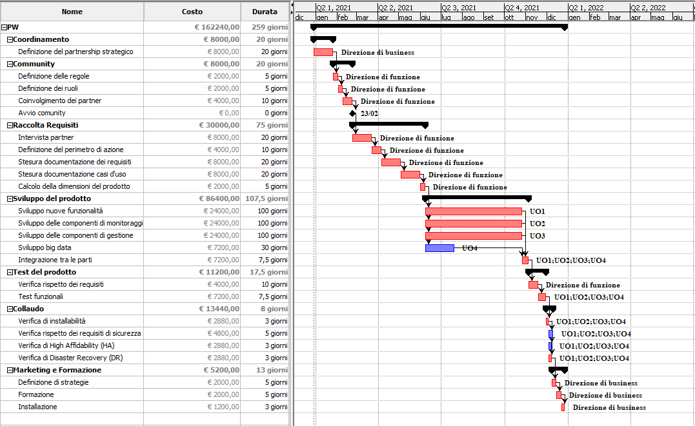
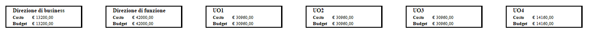

Ambito Economico
================

Vista la mission e l’organizzazione aziendale si è ipotizzata una
possibile WBS (Work Breakdown Structure) suddiviso in sei WP (Work
Project), ogni WP sarà di responsabilità di gruppi specifici che
dovranno occuparsi delle macro attività indicate.

WP1: Coordinamento
~~~~~~~~~~~~~~~~~~

-  **Definizione del partnership strategico**: fase strategica per
   determinare e definire i partner strategici che potrebbe determinare
   valore aggiunto nella definizione ed esecuzione del progetto.

WP2: Community
~~~~~~~~~~~~~~

-  **Definizione delle regole**: è necessario definire e determinare
   regole e modalità di utilizzo della community. Come in ogni community
   sarà necessario individuare profili di utenti e gruppi, i loro
   compiti e le loro modalità operative all’interno della community.
-  **Definizione dei ruoli**: verranno determinati i ruoli dei gruppi di
   utenti che dovranno soddisfare le esigenze del progetto e finalità
   della community
-  **Coinvolgimento dei partner**: si dovrà capire in quale modalità e
   tempi coinvolgere i partner per migliorare e permettere una piena
   collaborazione degli stessi
-  **Avvio community**: fase operativa nel creare e rendere operativo la
   community definita nei punti precedenti. In questa fase sarà
   necessario determinare le parti tecniche sul come e dove questo
   servizio deve essere erogato.

WP3: Raccolta Requisiti
~~~~~~~~~~~~~~~~~~~~~~~

-  **Intervista partner**: partendo da un elenco di requisiti generici,
   che potrebbero essere considerati la base comune su cui partire il
   progetto, è necessario coinvolgere i partner fin dalle prime fasi per
   raccogliere requisiti essenziali arricchendo i requisiti di base di
   dettagli che ogni partner potrebbe avere necessità di arricchire e
   approfondire in base alle proprie peculiarità.
-  Definizione del perimetro di azione: la raccolta dei requisiti
   determinerà un ulteriori fase di analisi di quanto raccolto e
   determinerà le priorità di svolgimento e realizzazione degli stessi.
-  **Stesura documentazione dei requisiti e casi d’uso**: è necessario
   creare documentazione dei requisiti raccolti e discussi e
   realizzazione di casi d’uso.
-  **Calcolo della dimensioni del prodotto**: raccolti i requisiti e
   casi d’uso che si vogliono realizzare sarà possibile determinare,
   facendo uso di Function Point e SNAP Point, una dimensione più
   adeguata e un calcolo dei costi di realizzazione più in linea con
   quanto determinato inizialmente. Questo permetterà di definire con
   più dettaglio e maggiore affidabilità l’esecuzione e il
   coinvolgimento delle risorse che dovranno essere coinvolte nei passi
   successivi. Questo fase di progetto potrebbe portare ad una revisione
   dal punto di vista delle tempistiche e dei costi.

WP4: Sviluppo del prodotto
~~~~~~~~~~~~~~~~~~~~~~~~~~

-  Sviluppo nuove funzionalità:
-  Sviluppo delle componenti di monitoraggio
-  Sviluppo delle componenti di gestione
-  Sviluppo big data
-  Integrazione tra le parti

WP5: Test del prodotto
~~~~~~~~~~~~~~~~~~~~~~

-  Verifica e rispetto dei requisiti
-  Test funzionali

WP6: Collaudo
~~~~~~~~~~~~~

-  Verifica di installabilità
-  Verifica rispetto dei requisiti di sicurezza
-  Verifica di High Affidability (HA)
-  Verifica di Disaster Recovery (DR)

WP7: Marketing e Formazione
~~~~~~~~~~~~~~~~~~~~~~~~~~~

-  **Definizione di strategie**: necessaria per affrontare in modo
   organizzato le fasi di marketing e formazione. Argomento fondamentale
   per trasmettere i vantaggi nell’adottare questa soluzione permettendo
   alle strutture aderenti di trarne i più ampi benefici di utilizzo. In
   questa fase si determinerà il modo più efficace per raggiungere
   l’obiettivo prefissato. La fase di marketing dovrà determinare il
   modo in cui pubblicizzare e promuovere l’iniziativa in modo da
   permettere il più ampio coinvolgimento al di fuori dei partner già
   coinvolti
-  **Formazione**: necessario per trasmettere la conoscenza e
   coinvolgimento di tutte le parti interessate. Sarà necessario
   suddividere i corsi formativi per tipo di utenti: dirigenti,
   responsabili, operatori. Questo permetterà una maggiore efficacia e
   attenzione nei confronti degli utenti in base alle loro
   caratteristiche formative e conoscitive.
-  **Installazione**: prevedere documentazione necessaria
   all’installazione e metodi per agevolare la configurazione del
   sistema e , ove necessario, prevedere installazioni personalizzate.
   In questa fase potrebbe emergere una esigenza di installazione della
   soluzione con affiancamento di un operatore.

Implementation Plan
~~~~~~~~~~~~~~~~~~~

Analizzando le diverse attività è stato definito un GANTT che
rappresenta le macro attività che dovremmo affrontare durante la
creazione del progetto.

|image4|

Ipotizzando inoltre un costo a risorsa è possibile una prima
determinazione dei costi di progetto e il legame tra le attività e la
OBS.

Per i costi di progetto è stato ipotizzato un costo di 30 €/h si è
ottenuto la seguente RBS

|image5|

con una stima di costo complessivo pari a 156.720 € come si può evincere
dal Gantt.

.. _section-4:

SWOT
~~~~

In questa sezione si vuole evidenziare e schematizzare l’analisi SWOT
inerente al Project Work.

======= ============================ ==============================
\       Vantaggi e opportunità       Rischi e Pericoli
Interno Strenght – Punti di forza:   Weakness – Punti di debolezza:
\                                    
Esterno Opportunities – Opportunità: Threats – Minacce:
\                                    
======= ============================ ==============================

**Strategie SO:** è necessario condividere e formare ad ogni livello
aziendale i punti di forza e le opportunità che si avrebbero
nell’adottare questo modo di lavorare. Questo fase è molto delicata e
molto importante perché permetterà di ottenere consensi su gli aspetti
più critici e meno positivi dell’intera SWOT Analisys. Questo permetterà
una maggiore consapevolezza, condivisione e partecipazione di tutti gli
stakeholder e renderà più agevole l’affrontare i punti di debolezza e
minacce

**Strategie WT:** le problematiche elencate in questa visione
necessitano di attività parallele per essere arginate. Sarà necessario
costruire o aggiornare l’intero asset aziendale e definire policy di
sicurezza coerenti con l’esistente mostrando i punti di forza e
debolezza dell’intera infrastruttura. Potrebbero esserci punti critici
non sfruttabili facilmente dall’esterno mentre potrebbero esserci casi
meno critici ad un prima analisi ma facilmente sfruttabili. Anche in
questa fase per calmierare le eventuali resistenze al cambiamento sarà
necessario un coinvolgimento sia formativo che lavorativo.

Strategie WO: in questo caso è possibile cogliere una certa
compensazione tra opportunità e minacce. Le minacce rimangono dei punti
di attenzione ma le opportunità potrebbero compensare senza alcun
problema le stesse annullandole.

**Strategie ST:**\ in questo caso i punti di forza possono compensare,
cogliendone i benefici, le minacce individuate.

