==================
Ambito Tecnologico
==================

L’aspetto tecnologico prevede sicuramente una fase di esplorazione del
AS-IS sui sistemi Open Source e commerciali già esistenti per capire se
sistemi già consolidati sulla tematica preposta possano essere di aiuto
a addirittura coprire in parte o totalmente i requisiti preposti.

Sia i CISO (Chief Information Security Officer) che i direttori
dell’area Risk&Compliance stanno valutando funzionalità e
caratteristiche offerte dai servizi di CTI (Cyber Threat Intelligence)
inserendoli nei piani di rafforzamento per l’aspetto di sicurezza delle
proprie aziende.

Questo trend è dettato dal fatto che entro il 2022, il 20% delle grandi
imprese utilizzerà servizi CTI per definire le proprie strategie alla
lotta contro attacchi informatici.

Ad oggi i maggiori fruitori dei servizi CTI commerciali sono i servizi
governativi e finanziari ma si incomincia a notare un aumento anche in
altri settori, causato sia da una maggiore maturità dei programmi di
sicurezza che dall’aumento esponenziale di attacchi informatici negli
ultimi anni hanno fatto emergere diverse lacune.

La CTI è una caratteristica importante e fondamentale di un programma di
Cybersecurity in particolare per le aziende che lavorano nel mercato
digitale.

Ad alto livello, i servizi CTI possono essere utilizzati in due
modalità:

-  fornire informazioni solo alle macchine o ai sistemi di elaborazione
   automatica, vale a dire MRTI (Machine-Readable Threat Intelligence)
-  fornire informazioni prodotti da team di specialisti, al TOP
   Management

Informazioni leggibili da una macchina/sistema di sicurezza
-----------------------------------------------------------

Sono informazioni principalmente di monitoraggio e/o notifica in tempo
reale, generalmente chiamati Indicator Of Compromise abbreviato in IoC
che sono artefatti ricavati in rete o in un sistema informatico che sono
correlabili a manomissioni o intrusioni.

Tipici IoC sono un indirizzo IP, un indice hash che identifica
univocamente un file malevolo, una URL, un dominio WEB da cui è stato
veicolato un attacco.

La determinazione degli IoC è una fase fondamentale per determinare in
modo organico, scientifico e ripetibile il tipo di attacco esaminato e
per capire le proporzioni del danno subito.

Gli IoC sono ricavati per lo più da fonti esterne e utilizzati per
arricchire i sistemi di sicurezza interna. Spesso includono anche
informazioni sull’attività operativa che si sta verificando (fonti
esterne) o si è già verificata (fonti interne) ma con approcci e
obiettivi puramente tecnici.

Informazioni prodotto da un team di specialisti
-----------------------------------------------

Sono informazioni acquisite da diverse fonti (Commerciali o Open
Source), contenenti elementi come TTP (Tactics, Techniques and
Procedures), Threat Actor o report prodotti da analisti umani. Queste
informazioni includono generalmente un’analisi su misura per il cliente,
con dettagli delle azioni di rimedio da effettuare.

Tutte queste informazioni sono generate utilizzando standard come
STIX/TAXII, JSON, etc. ed elaborate da piattaforme commerciali chiamate
TIP (commerciali) od Open Source come MISP utilizzate per effettuare una
corretta Cyber Threat Information Sharing e, in particolare, per
svolgere un’attività di Cyber Threat Hunting.

La Cyber Threat Information Sharing è un ecosistema dove esiste una
condivisione real-time di un’informazione utilizzabile di Cyber Threat,
in grado di incrementare le difese di un’organizzazione (privata o
pubblica) in ottica di prevenzione, identificazione e mitigazione della
Cyber Threat prima che possa esserci un impatto reale
sull’organizzazione stessa.

**Il mercato si divide tra tecnologie/piattaforme di Cyber Threat
Intelligence commerciali e open source.** Entrambe le
tecnologie/piattaforme sono usate per la gestione delle Cyber Threat, ma
applicate in modi diversi.

Esistono diversi elementi da considerare per effettuare un confronto tra
le diverse tecnologie da adottare nel mondo della CTI. In particolare
possiamo distinguere cinque principali elementi caratterizzanti, che
sono:

-  gestione dei feed e fusione di diverse fonti;
-  capacità di arricchimento, analisi e discovery dei dati;
-  etichettatura dei dati e delle fonti e information sharing;
-  gestione degli utenti e collaborazione tra i team;
-  scalabilità e supporto.

Da uno studio fatto nel 2019 sulle principali differenze tra le maggiori
tecnologie/piattaforme commerciali e opensource disponibili sul mercato
rispetto alle diverse categorie di elementi (category) e caratteristiche
tecnica per ogni singola categoria (features) si è ottenuto quanto
segue:

|image6|

Come si può notare nel 2019 il confronto tra prodotti OpenSource e
commerciali mostrava una carenza negli aspetti legati a:

-  possibilità di generazione di report ad hoc
-  possibilità di effettuare un’opportuna etichettatura delle fonti
-  Manutenzione e supporto

Osservando l’evoluzione dei progetti OpenSource, in particolare del
protetto OpenSource MISP, si è potuto notare come parte di queste
mancanze siano state colmate nel tempo fornendo una soluzione sempre più
ricca e maggiormente confrontabile con soluzioni commerciali, ad esempio
MISP è in grado ad oggi di effettuare una valida etichettatura delle
fonti.

Esistono diversi prodotti che potrebbero soddisfare le esigenze di
condivisione di informazioni riguardanti attacchi informatici e questo è
un elenco delle principali soluzioni CTI OpenSource e Commerciali
esistenti sul mercato:

+---------+---------+---------+---------+---------+---------+---------+
|         |         |         |         |         | Licence | Last    |
|  Name   |  Type   |  Year   | Owner   | Project |         | Update  |
|         |         |         |         | site(s) |         |         |
|         |         |         |         |         |         |         |
+---------+---------+---------+---------+---------+---------+---------+
| Collab  | Open    | 2014    | MITRE   | `link   | MIT     | 29/     |
| orative | Source  |         |         | 1 <ht   | Licence | 07/2019 |
| R       |         |         |         | tp://li |         |         |
| esearch |         |         |         | nk/>`__ |         |         |
| Into    |         |         |         |         |         |         |
| Threats |         |         |         | `link   |         |         |
| (CRITs) |         |         |         | 2 <ht   |         |         |
|         |         |         |         | tps:/   |         |         |
|         |         |         |         | /github |         |         |
|         |         |         |         | .com/cr |         |         |
|         |         |         |         | its>`__ |         |         |
+---------+---------+---------+---------+---------+---------+---------+
| Col     | Open    | 2012    | CSIRT   | `link   | Mozilla | 07/     |
| lective | Source  |         | Gadgets | 1 <ht   | Public  | 06/2020 |
| Intel   |         |         |         | tp://   | License |         |
| ligence |         |         | Fou     | csirtga | Version |         |
| Fr      |         |         | ndation | dgets.o | 2.0     |         |
| amework |         |         |         | rg/>`__ |         |         |
| (CIF)   |         |         |         |         |         |         |
|         |         |         |         | `link   |         |         |
|         |         |         |         | 2 <ht   |         |         |
|         |         |         |         | tps:/   |         |         |
|         |         |         |         | /github |         |         |
|         |         |         |         | .com/cs |         |         |
|         |         |         |         | irtgadg |         |         |
|         |         |         |         | ets>`__ |         |         |
+---------+---------+---------+---------+---------+---------+---------+
| GOSINT  | Open    | 2017    | Cisco   | `link   | Co      | 04/     |
|         | Source  |         |         | 1 <ht   | pyright | 08/2018 |
|         |         |         |         | tps     | (c)     |         |
|         |         |         |         | ://gith | 2017,   |         |
|         |         |         |         | ub.com/ | Cisco   |         |
|         |         |         |         | ciscocs | S       |         |
|         |         |         |         | irt/GOS | ystems, |         |
|         |         |         |         | INT>`__ | Inc.    |         |
|         |         |         |         |         | All     |         |
|         |         |         |         | `link   | rights  |         |
|         |         |         |         | 2 <ht   | re      |         |
|         |         |         |         | tps://g | served. |         |
|         |         |         |         | osint.r |         |         |
|         |         |         |         | eadthed |         |         |
|         |         |         |         | ocs.io/ |         |         |
|         |         |         |         | en/late |         |         |
|         |         |         |         | st/>`__ |         |         |
+---------+---------+---------+---------+---------+---------+---------+
| MANTIS  | Open    | 2013    | SIEMENS | `link   | GNU     | 29/     |
| Cyber   | Source  |         |         | <ht     | General | 11/2013 |
| Threat  |         |         |         | tps://g | Public  |         |
| Intel   |         |         |         | ithub.c | License |         |
| ligence |         |         |         | om/siem | v2.0    |         |
| Man     |         |         |         | ens/dja |         |         |
| agement |         |         |         | ngo-man |         |         |
| Fr      |         |         |         | tis>`__ |         |         |
| amework |         |         |         |         |         |         |
+---------+---------+---------+---------+---------+---------+---------+
| Malware | Open    | 2012    | CIRCL   | `link   | GNU     | 14/     |
| Info    | Source  |         |         | 1 <http | Affero  | 07/2020 |
| rmation |         |         |         | ://www. | General |         |
| Sharing |         |         |         | misp-pr | Public  |         |
| P       |         |         |         | oject.o | License |         |
| latform |         |         |         | rg/>`__ | v3.0    |         |
| (MISP)  |         |         |         |         |         |         |
|         |         |         |         | `link   |         |         |
|         |         |         |         | 2 <ht   |         |         |
|         |         |         |         | tps:    |         |         |
|         |         |         |         | //githu |         |         |
|         |         |         |         | b.com/M |         |         |
|         |         |         |         | ISP>`__ |         |         |
|         |         |         |         |         |         |         |
|         |         |         |         | `link   |         |         |
|         |         |         |         | 3 <htt  |         |         |
|         |         |         |         | ps://ww |         |         |
|         |         |         |         | w.misp- |         |         |
|         |         |         |         | project |         |         |
|         |         |         |         | .org/co |         |         |
|         |         |         |         | mmuniti |         |         |
|         |         |         |         | es/>`__ |         |         |
+---------+---------+---------+---------+---------+---------+---------+
| M       | Open    | 2016    | Palo    | `link   | Apache  | 13/     |
| ineMeld | Source  |         | Alto    | <https: | License | 05/2020 |
|         |         |         |         | //githu | 2.0     |         |
|         |         |         |         | b.com/P |         |         |
|         |         |         |         | aloAlto |         |         |
|         |         |         |         | Network |         |         |
|         |         |         |         | s/minem |         |         |
|         |         |         |         | eld>`__ |         |         |
+---------+---------+---------+---------+---------+---------+---------+
| Yeti    | Open    | 2017    | Yeti    | `link   | Apache  | 27/     |
|         | Source  |         |         | 1 <h    | License | 05/2020 |
|         |         |         |         | ttps:// | 2.0     |         |
|         |         |         |         | yeti-pl |         |         |
|         |         |         |         | atform. |         |         |
|         |         |         |         | github. |         |         |
|         |         |         |         | io/>`__ |         |         |
|         |         |         |         |         |         |         |
|         |         |         |         | `link   |         |         |
|         |         |         |         | 2 <h    |         |         |
|         |         |         |         | ttps:// |         |         |
|         |         |         |         | github. |         |         |
|         |         |         |         | com/yet |         |         |
|         |         |         |         | i-platf |         |         |
|         |         |         |         | orm>`__ |         |         |
+---------+---------+---------+---------+---------+---------+---------+
| TheHive | Open    | 2014    | TheHive | `link   | GNU     | 25/     |
|         | Source  |         |         | <htt    | Affero  | 04/2020 |
|         |         |         |         | ps://gi | General |         |
|         |         |         |         | thub.co |         |         |
|         |         |         |         | m/TheHi | Public  |         |
|         |         |         |         | ve-Proj | Licence |         |
|         |         |         |         | ect>`__ | v3.0    |         |
+---------+---------+---------+---------+---------+---------+---------+
| Cortex  | Open    | 2014    | TheHive | `link   | GNU     | 20/     |
|         | Source  |         |         | <htt    | Affero  | 01/2020 |
|         |         |         |         | ps://gi | General |         |
|         |         |         |         | thub.co |         |         |
|         |         |         |         | m/TheHi | Public  |         |
|         |         |         |         | ve-Proj | Licence |         |
|         |         |         |         | ect>`__ | v3.0    |         |
+---------+---------+---------+---------+---------+---------+---------+
| Threa   | Com     | 2013    | Anomali | `link   |         | n.a.    |
| tStream | mercial |         |         | <h      |         |         |
|         |         |         |         | ttps:// |         |         |
|         |         |         |         | www.ano |         |         |
|         |         |         |         | mali.co |         |         |
|         |         |         |         | m/platf |         |         |
|         |         |         |         | orm>`__ |         |         |
+---------+---------+---------+---------+---------+---------+---------+
| Ecl     | Com     | 2014    | Ecl     | `link   |         | n.a.    |
| ecticIQ | mercial |         | ecticIQ | <http   |         |         |
| P       |         |         |         | s://www |         |         |
| latform |         |         |         | .eclect |         |         |
|         |         |         |         | iciq.co |         |         |
|         |         |         |         | m/platf |         |         |
|         |         |         |         | orm>`__ |         |         |
+---------+---------+---------+---------+---------+---------+---------+
| Looki   | Com     | 2015    | Looki   | `link   |         | n.a.    |
| ngGlass | mercial |         | ngGlass | <http   |         |         |
|         |         |         |         | s://www |         |         |
|         |         |         |         | .lookin |         |         |
|         |         |         |         | gglassc |         |         |
|         |         |         |         | yber.co |         |         |
|         |         |         |         | m/produ |         |         |
|         |         |         |         | cts/man |         |         |
|         |         |         |         | age-int |         |         |
|         |         |         |         | elligen |         |         |
|         |         |         |         | ce/>`__ |         |         |
+---------+---------+---------+---------+---------+---------+---------+
| C       | Com     | 2019    | C       | `link   |         | n.a.    |
| elerium | mercial |         | elerium | <h      |         |         |
|         |         |         |         | ttps:// |         |         |
|         |         |         |         | www.cel |         |         |
|         |         |         |         | erium.c |         |         |
|         |         |         |         | om/>`__ |         |         |
+---------+---------+---------+---------+---------+---------+---------+
| Threat  | Com     | 2013    | Threat  | `link   |         | n.a.    |
| Connect | mercial |         | Connect | <https: |         |         |
|         |         |         |         | //www.t |         |         |
|         |         |         |         | hreatco |         |         |
|         |         |         |         | nnect.c |         |         |
|         |         |         |         | om/>`__ |         |         |
+---------+---------+---------+---------+---------+---------+---------+
| ThreatQ | Com     | 2015    | ThreatQ | `link   |         | n.a.    |
| P       | mercial |         | uotient | <h      |         |         |
| latform |         |         |         | ttps:// |         |         |
|         |         |         |         | www.thr |         |         |
|         |         |         |         | eatq.co |         |         |
|         |         |         |         | m/threa |         |         |
|         |         |         |         | tq/>`__ |         |         |
+---------+---------+---------+---------+---------+---------+---------+
| TruSTAR | Com     | 2014    | TruSTAR | `link   |         | n.a.    |
|         | mercial |         | Techn   | <ht     |         |         |
|         |         |         | ologies | tps://t |         |         |
|         |         |         |         | rustar. |         |         |
|         |         |         |         | co/>`__ |         |         |
+---------+---------+---------+---------+---------+---------+---------+
| Open    | Co      | 2012    | Ali     | `link   |         | n.a.    |
| Threat  | mmunity |         | enVault | <ht     |         |         |
|         |         |         |         | tps://w |         |         |
| E       |         |         |         | ww.alie |         |         |
| xchange |         |         |         | nvault. |         |         |
| (OTX)   |         |         |         | com/ope |         |         |
|         |         |         |         | n-threa |         |         |
|         |         |         |         | t-excha |         |         |
|         |         |         |         | nge>`__ |         |         |
+---------+---------+---------+---------+---------+---------+---------+
| ThreatE | Co      | 2015    | F       |`link    |         | n.a.    |
| xchange | mmunity |         | acebook |<https://|         |         |
|         |         |         |         |developer|         |         |
|         |         |         |         |s.fa     |         |         |
|         |         |         |         |cebook.  |         |         |
|         |         |         |         |com/     |         |         |
|         |         |         |         |products |         |         |
|         |         |         |         |/threat  |         |         |
|         |         |         |         |-excha   |         |         |
|         |         |         |         |nge>`__  |         |         |
+---------+---------+---------+---------+---------+---------+---------+
| X-Force | Co      | 2015    | IBM     | `link   |         | n.a.    |
| E       | mmunity |         |         | <https: |         |         |
| xchange |         |         |         | //excha |         |         |
|         |         |         |         | nge.xfo |         |         |
|         |         |         |         | rce.ibm |         |         |
|         |         |         |         | cloud.c |         |         |
|         |         |         |         | om/>`__ |         |         |
+---------+---------+---------+---------+---------+---------+---------+
| Threat  | Co      | 2015    | Micro   | `link   |         | n.a.    |
| Central | mmunity |         | Focus   | <http   |         |         |
|         |         |         |         | s://www |         |         |
|         |         |         |         | .microf |         |         |
|         |         |         |         | ocus.co |         |         |
|         |         |         |         | m/it-it |         |         |
|         |         |         |         | /soluti |         |         |
|         |         |         |         | ons/app |         |         |
|         |         |         |         | licatio |         |         |
|         |         |         |         | n-secur |         |         |
|         |         |         |         | ity>`__ |         |         |
+---------+---------+---------+---------+---------+---------+---------+

Come si può notare nell’ambito della Cyber Security l’aspetto e la
gestione dei fenomeni legati ad attacchi informatici è in continua
crescita e denotano una caratteristica comune che è quella di
condividere le informazioni per aumentare l’efficacia della difesa.

Dal piano triennale ICT 2019-2021 sulla sicurezza informatica AGID ha
attivato un progetto per la sperimentazione delle modalità di scambio
automatico di informazioni operative (indicatori di compromissione) tra
strutture di sicurezza mediante protocolli STIX e TAXII tramite
piattaforme per la raccolta, l'archiviazione, la distribuzione e la
condivisione di indicatori di sicurezza informatica e minacce relative
all'analisi degli incidenti.

Tale sperimentazione, che comprende due Gruppi di lavoro dedicati
rispettivamente agli aspetti tecnici ed alla definizione di una
tassonomia ad hoc, ha lo scopo di produrre le specifiche tecniche ed
organizzative che verranno emanate come standard per la realizzazione di
un sistema nazionale di interscambio automatico di indicatori di
compromissione qualificati tra operatori

accreditati.

La proposta coinvolge tre strumenti open-source e la realizzazione da
parte della CERT-PA di un modulo software che permette l’integrazione di
queste tre soluzioni.

Nella loro soluzione propongono l’uso dei seguenti strumenti
open-source:

-  **MineMeld:**\ applicazione open-source che semplifica
   l'aggregazione, l'applicazione e la condivisione di minacce
   informatiche.

   -  Nativamente collegato a Palo Alto Firewall
   -  Licence: Apache License Version 2.0
   -  Repository: https://github.com/PaloAltoNetworks/minemeld

-  **MISP:**\ piattaforma per la condivisione di minacce informatiche,
   l'archiviazione e la correlazione degli indicatori di compromissione
   di attacchi mirati, informazioni sulle minacce, informazioni sulla
   frode finanziaria, informazioni sulla vulnerabilità o persino
   informazioni antiterrorismo.

   -  Licence: AGPL-3.0-or-later , BSD 2-Clause “Simplified” License ,
      CC0-1.0 or BSD 2-Clause “Simplified” License
   -  Repository: https://github.com/MISP/MISP

-  **CABBY:**\ libreria Python per interagire con server che utilizzano
   il protocollo TAXII.

   -  Licence: BSD 3-Clause
   -  https://github.com/eclecticiq/cabby/blob/master/LICENSE.rst
   -  Repository: https://github.com/EclecticIQ/cabby

-  **CNTI:**\ agevolare la ricezione delle informazioni tramite
   differenti servizi – come i framework MineMeld e l’istanza MISP del
   CERT-PA, del client CNTI o della libreria Cabby di EclecticIQ –
   garantisce interoperabilità con i sistemi e prodotti di terze parti
   già in uso dalle organizzazioni.

   -  Licence: non trovato
   -  Repository: non trovato

In questa fase la CERT-PA sta subendo profondi cambiamenti organizzativi
che non ci permettono al momento di approfondire ulteriormente la
soluzioni da loro proposta.

Da questo studio di mercato emerge un enorme interesse sull’argomento e
importanti lavori effettuati da parte di società commerciali e anche
dalle comunità open-source che stanno aggiungendo servizi di supporto
agli strumenti realizzati per sopperire alle carenze in questo senso e
soddisfare le esigenze richieste dai clienti.

L’approccio che è emerso al momento più interessante è l’uso di tre
prodotti open-source per ottenere un sistema CTI il più completo
possibile, questi strumenti nascono dal più conosciuto MISP e aggiungono
funzionalità al MISP attuale fornendo un più completo ecosistema
nell’effettuare analisi e gestione dei casi anomali riscontrati. Inoltre
gli strumenti prevedono una completa integrazione con il MISP ricavando
e/o arricchendo le informazioni ottenute dallo stesso.

La soluzione prevede l’uso di questi strumenti:

-  TheHive
-  Cortex
-  MISP

TheHive
~~~~~~~

E’ una piattaforma di Security Incident Response scalabile open source
completamente integrata con il MISP (Malware Information Sharing
Platform) disegnata per agevolare il lavoro di SOC, CSIRT, CERT e
qualsiasi altro fruitore/forniture che gestisca informazioni di
sicurezza che necessitano di analizzare e agire rapidamente a fronte di
attacchi informatici.

L’approccio di TheHive è quello di fornire una piattaforma che possa
garantire un modello collaborativo sull’analisi e risoluzione di un
attacco informatico.

Grazie al flusso di lavoro integrato è possibile inserire e gestire
informazioni in tempo reale relative a casi nuovi o esistenti, attività,
osservabili e IOC e queste sono rese disponibili per tutti i membri del
team.

Inoltre è possibile grazie a notifiche speciali gestire o assegnare
nuove attività e visualizzare in anteprima nuovi eventi e avvisi forniti
dal MISP.

TheHive permette inoltre di aggiungere metriche e campi personalizzabili
che permettono di guidare le attività di un team, e gli analisti possono
registrare i loro progressi e allegare prove e file degni di nota,
aggiungere tag e importare archivi ZIP protetti da password contenenti
malware o dati sospetti senza aprirli.

Inoltre è possibile partire da un evento fornito dal MISP, effettuare il
triage usando le potenzialità di Cortex, per analizzare in maniera più
completa e così ottenere risposte sul IOC analizzato nel più breve tempo
possibile.

Una volta completate le indagini, esportare IOC in una o più istanze
MISP.

Cortex
~~~~~~

Cortex è uno strumento capace di interagire con numerosi altri servizi,
ad oggi ne sono disponibili 147, tra cui alcuni gratuiti e alcuni a
pagamento per una analisi più completa del IOC che si sta analizzando
questo strumento permette di diminuire i tempi di analisi e avere un
unico punto come raccolta di informazioni forniti dai molteplici servizi
ad oggi a disposizione sul Web.

Inoltre permette la creazione di analizzatori o responder personalizzati
utilizzando qualsiasi linguaggio di programmazione supportato da Linux,
permettendo di condividere i risultati con tutto il team o, meglio, con
tutta la comunità.

Inoltre è possibile eseguire più interrogazioni contemporanee su più
instanze MISP a disposizione.

Cortex, nato dallo stesso gruppo di TheHive, permette una integrazione
nativa con quest’ultimo fornendo a TheHive uno strumento aggiuntivo che
permette di eseguire centinaia di controlli su più instanze di Cortex
contemporaneamente fornendo a quest’ultimo i risultati ottenuti e grazie
al motore di report di TheHive è possibile visualizzarlo nel modo
desiderato.

MISP
~~~~

Una piattaforma di intelligence per la condivisione delle minacce,
l'archiviazione e la correlazione degli indicatori di compromissione
(IOC) di attacchi mirati, informazioni sulle minacce, informazioni sulla
frode finanziaria, informazioni sulla vulnerabilità o persino
informazioni antiterrorismo.

MISP viene utilizzato oggi in più organizzazioni non solo per
archiviare, condividere, collaborare su indicatori di sicurezza
informatica, analisi di malware, ma anche per utilizzare gli IOC e le
informazioni per rilevare e prevenire attacchi, frodi o minacce contro
le infrastrutture, le organizzazioni o le persone ICT.

Questo sistema permette di:

-  avere un database di IoC e indicatori efficienti che consentono di
   archiviare informazioni tecniche e non tecniche su campioni di
   malware, incidenti, aggressori e informazioni di intelligence.
-  Correlazione automatica per trovare relazioni tra attributi e
   indicatori di malware, campagne di attacchi o analisi. Il motore di
   correlazione include la correlazione tra attributi e correlazioni più
   avanzate come la correlazione hash Fuzzy (ad esempio ssdeep) o la
   corrispondenza dei blocchi CIDR. La correlazione può anche essere
   abilitata o l'evento disabilitato per attributo.
-  Un modello di dati flessibile in cui oggetti complessi possono essere
   espressi e collegati tra loro per esprimere informazioni sulle
   minacce, incidenti o elementi connessi.
-  Funzionalità di condivisione integrata per facilitare la condivisione
   dei dati utilizzando diversi modelli di distribuzioni. MISP può
   sincronizzare automaticamente eventi e attributi tra diversi MISP.
   Funzionalità di filtro avanzate possono essere utilizzate per
   soddisfare ogni politica di condivisione di un'organizzazione tra cui
   una capacità di gruppo di condivisione flessibile e meccanismi di
   distribuzione a livello di attributo.
-  Un'interfaccia utente intuitiva per gli utenti finali per creare,
   aggiornare e collaborare su eventi e attributi / indicatori.
   Un'interfaccia grafica per navigare senza soluzione di continuità tra
   gli eventi e le loro correlazioni. Una funzionalità del grafico degli
   eventi per creare e visualizzare relazioni tra oggetti e attributi.
   Funzionalità di filtro avanzate ed elenco di avvisi per aiutare gli
   analisti a contribuire con eventi e attributi.
-  archiviare i dati in un formato strutturato (che consente l'uso
   automatizzato del database per vari scopi) con un ampio supporto di
   indicatori di sicurezza informatica insieme a indicatori di frode
   come nel settore finanziario.
-  esportazione: generazione di IDS (Suricata, Snort e Bro sono
   supportati per impostazione predefinita), OpenIOC, output in testo
   normale, CSV, MISP XML o JSON per l'integrazione con altri sistemi
   (ID di rete, ID host, strumenti personalizzati)
-  importazione: importazione in blocco, importazione in batch,
   importazione in testo libero, importazione da OpenIOC, sandbox GFI,
   ThreatConnect CSV o formato MISP.
-  Strumento flessibile di importazione di testo libero per facilitare
   l'integrazione di report non strutturati in MISP.
-  Un sistema gentile per collaborare su eventi e attributi che consente
   agli utenti MISP di proporre modifiche o aggiornamenti ad attributi /
   indicatori.
-  condivisione dei dati: scambio e sincronizzazione automatici con
   altre parti e gruppi di fiducia mediante MISP.
-  importazione di feed: strumento flessibile per importare e integrare
   feed di MISP e qualsiasi feed di minacce o OSINT da terze parti.
   Molti feed predefiniti sono inclusi nell'installazione MISP standard.
-  delega della condivisione: consente un semplice meccanismo
   pseudo-anonimo per delegare la pubblicazione di eventi / indicatori a
   un'altra organizzazione.
-  API flessibile per integrare MISP con le altre soluzioni. MISP è in
   bundle con PyMISP che è una libreria Python flessibile per
   recuperare, aggiungere o aggiornare gli attributi degli eventi,
   gestire campioni di malware o cercare attributi.
-  tassonomia regolabile per classificare e taggare gli eventi seguendo
   i propri schemi di classificazione o tassonomie esistenti. La
   tassonomia può essere locale per il tuo MISP ma anche condivisibile
   tra le istanze MISP. MISP viene fornito con un set predefinito di
   tassonomie e schemi di classificazione noti per supportare la
   classificazione standard utilizzata da ENISA, Europol, DHS, CSIRT o
   molte altre organizzazioni.
-  i vocabolari dell'intelligence chiamati galassia MISP e in bundle con
   attori della minaccia esistenti, malware, RAT, ransomware o MITRE
   ATT&CK che possono essere facilmente collegati agli eventi in MISP.
-  moduli di espansione in Python per espandere MISP con i propri
   servizi o attivare moduli di errore già disponibili.
-  supporto di avvistamento per ottenere osservazioni da organizzazioni
   riguardanti indicatori e attributi condivisi. L'avvistamento può
   essere fornito tramite l'interfaccia utente MISP, API come documento
   MISP o documenti di avvistamento STIX.
-  Supporto STIX: esportazione dei dati nel formato STIX (XML e JSON)
   inclusa esportazione/importazione nel formato STIX 2.0.
-  crittografia integrata e firma delle notifiche tramite PGP e/o S/MIME
   a seconda delle preferenze dell'utente.
-  Canale di abbonamento di pubblicazione in tempo reale all'interno di
   MISP per ottenere automaticamente tutte le modifiche.

Condividere con gli umani
-------------------------

I dati archiviati sono immediatamente disponibili per colleghi e
partner. Memorizza l'ID evento nel tuo sistema di biglietteria o sarai
informato dalle notifiche e-mail firmate e crittografate.

Condivisione con le macchine
----------------------------

Generando regole Snort/Suricata/Bro/Zeek IDS, le esportazioni STIX,
OpenIOC, text o csv MISP consente di importare automaticamente i dati
nei sistemi di rilevamento con conseguente rilevamento migliore e più
rapido delle intrusioni.

L'importazione dei dati può anche essere eseguita in vari modi:
importazione di testo libero, OpenIOC, importazione batch, importazione
di risultati sandbox o utilizzo di modelli preconfigurati o
personalizzati.

Se si esegue MISP internamente, i dati possono anche essere caricati e
scaricati automaticamente da e verso istanze MISP ospitate esternamente.
Grazie a questa automazione e allo sforzo degli altri, ora si è in
possesso di preziosi indicatori di compromesso senza lavoro aggiuntivo.

Condivisione collaborativa di analisi e correlazione
----------------------------------------------------

Quando vengono aggiunti nuovi dati, MISP mostrerà immediatamente le
relazioni con altri osservabili e indicatori esitenti. Ciò si traduce in
un'analisi più efficiente, ma consente anche di avere un quadro migliore
dei TTP, delle campagne correlate e dell'attribuzione.

La funzione di discussione consentirà anche conversazioni tra più
analisti con conseguente beneficio per tutti.

Architettura
~~~~~~~~~~~~

Sia TheHive che Cortex forniscono librerie per essere integrate con
strumenti di terze parti, queste librerie, chiamate: TheHive4py e
Cortex4py permettono di fornire interfacce e servizi per una più facile
integrazione.

TheHive e Cortex nascono dal progetto open source che è consultabile su
questo link https://thehive-project.org/ inoltre forniscono, ad oggi, un
supporto professionale nel caso in cui fosse necessario.

Un possibile schema architetturale di questo ecosistema potrebbe essere
il seguente:

Questo ecosistema risulta interessante per diversi aspetti non solo
funzionali ma anche di interoperabilità con soluzioni proposte perché è
possibile sfruttare il MISP per mantenere e agevolare la condivisione
delle informazioni ottenute da una analisi di un incidente informatico.

La presenza del MISP infatti permette di interagire con altre proposte
che ne fanno già uso come quella descritta in precedenza e proposta
dalla CERT-PA in collaborazione con Agid.

Tutti gli strumenti permettono una comunicazione sicura in HTTPS l’una
con l’altra e un sistema di autenticazione e profilazione su ogni
singolo strumento permettendo di gestire con accuratezza anche aspetti
di privacy.

Caso d’uso
~~~~~~~~~~

Senza entrare nel merito delle singole piattaforme e delle diverse
caratteristiche che ognuno può offrire che demandiamo alle
documentazioni ufficiali, analizzeremo un caso d’uso pratico di come
queste piattaforme possano fornire un valido sostegno nell’analisi di
problematiche di sicurezza e nella modalità di condivisione tra le parti
e eventualmente la possibilità di condivisione dell’analisi fatte con
altre organizzazioni.

Una volta eseguito il login su TheHive si ottiene accesso alla dashboard
corrispondente in grado di riassumere le attività ancora da svolgere o
nuove attività che possono essere state assegnate.

|image7|

essendo il primo accesso e non avendo casi da analizzare se ne può
creare uno nuovo nel quale è possibile aggiungere macro informazioni su
quello che si vorrà fare in seguito.

Una volta creato il caso d’uso sarà possibile aggiungere delle attività
da demandare a gruppi specifici di analisti e aggiungere le azioni
osservabili su cui si potrà chiedere aiuto a Cortex per ottenere
informazioni più dettagliate a loro riguardo.

|image8|

Come si può notare dalla schermata in questo caso d’uso è stato
richiesto di effettuare dei controlli su un file specifico, una url e un
indirizzo IP.

Una volta inseriti gli elementi da controllare è possibile sia
simultaneamente che singolarmente richiedere a Cortex un’analisi più
dettagliata specificando quali servizi utilizzare in base alla
configurazione di Cortex effettuata.

Una volta selezionati gli oggetti che si vuole osservare è possibile
tramite il pulsante “Action” richiedere l’inizio dell’analisi
selezionando gli opportuni servizi, come mostrato nell’immagine
sottostante.

|image9|

Una volta selezionati e premuto il pulsante “Run selected analyzers” si
otterrà dopo pochi istanti il risultato dell’analisi svolta per ogni
oggetto selezionato.

Per una più facile visualizzazione i vari oggetti osservati verranno
arricchiti di “Tag” che conterranno informazioni sia testuale che visivo
mostrando delle colorazioni diverse in base alle analisi fatte.

|image10|

Per capire cosa sia avvenuto realmente a fronte di pochi passaggi è
necessario collegarsi a Cortex per rendersi conto del lavoro effettuato.

Nella schermata seguente si può notare come Cortex abbia semplificato il
lavoro che andrebbe fatto a mano su singoli quesiti e che ha svolto in
parallelo.

|image11|

Una volta effettuata l’analisi sfruttando TheHive e il motore Cortex per
ottenere le informazioni necessarie è possibile pubblicare questo caso
di studio a MISP dicendo a TheHive di condividerlo con il MISP, premendo
il tasto “Share”

|image12|

Collegandosi al MISP è infine possibile osservare l’avvenuta
comunicazione tra TheHive e MISP.

|image13|

A questo punto è possibile come per ogni altro evento presente su MISP
poterlo condividere con altre organizzazioni e ad altri MISP esistenti.

.. _section-5:

Interoperabilità e tipi di dati
~~~~~~~~~~~~~~~~~~~~~~~~~~~~~~~

L'interoperabilità tra i sistemi è assicurata da collegamenti punto a
punto così facendo è possibile ottenere altri casi d’uso interessanti in
aggiunto a quello appena descritto, come ad esempio:

-  TheHive rimane in ascolto di nuovi eventi presenti sul MISP
   eventualmente filtrandoli a seconda dell’interesse da cui si può
   iniziare o proseguire un analisi sull’evento
-  il MISP è collegabile direttamente a Cortex permettendo di utilizzare
   direttamente le API fornitegli e arricchendo il proprio evento con
   ulteriori dettagli senza essere obbligati a usare TheHive.

L’intercomunicazione tra i sistemi è gestita tramite API di tipo REST
con collegamenti HTTP/HTTPS il che permette uno scambio di messaggi
interpretabili e di tipo JSON e, inoltre, i sistemi necessitano della
creazione di particolari utenti per comunicare fra di loro.

Questo permette una gestione sicura del dato e dell’impossibilità di
avere interferenze esterne sui tipi di analisi fatte mantenendo sicuro e
configurabile l’intero ecosistema.

Sia MISP che Cortex, pur avendo obbiettivi diversi, permettono
l’integrazione con sistemi esterni facendo uso di protocolli STIX/TAXII.

STIX
~~~~

Con STIX, tutti gli aspetti di sospetto, compromesso e attribuzione
possono essere rappresentati chiaramente con oggetti e relazioni
descrittive. Le informazioni STIX possono essere rappresentate
visivamente per un analista o archiviate come JSON per essere
rapidamente leggibili dal computer. L'apertura di STIX consente
l'integrazione in strumenti e prodotti esistenti o utilizzati per
esigenze specifiche dell'analista o della rete.

Gli oggetti STIX categorizzano ogni informazione con attributi specifici
da popolare. Il concatenamento di più oggetti attraverso relazioni
consente rappresentazioni semplici o complesse di CTI.

Di seguito è riportato un elenco di ciò che può essere rappresentato
tramite STIX che è un linguaggio ed un formato di serializzazione
open-source, usato per scambiare cyber threat intelligence in maniera
consistente e machine-readable, in modo da essere di supporto
all'analisi

collaborativa delle minacce e lo scambio automatizzato di informazioni
di intelligence.

Definisce 12 oggetti (STIX Domain Objects, SDOs) e due tipi di relazioni
(STIX Relationship Objects, SROs).

Gli oggetti sono:

-  **Attack Pattern**: Un tipo di TTP che descrive i modi in cui gli
   attaccanti cercano di compromettere un obiettivo

-  **Campaign**: Un insieme di comportamenti degli attaccanti che
   descrivono un gruppo di attività malevole o attacchi che succedono in
   un determinato periodo e contro uno specifico insieme di obiettivi
-  **Course of Action**: Un'azione presa per prevenire o rispondere ad
   un attacco
-  **Identity**: Individui, organizzazioni o gruppi
-  **Indicator**: Una caratteristica che permette di rilevare attivita
   informatiche malevole o sospette
-  **Intrusion Set**: Un gruppo di comportamenti e risorse con proprieta
   comuni che si crede siano governate da un singolo attore
-  **Malware**: Un tipo di TTP, conosciuto anche come codice o programma
   malevolo, usato per compromettere confidenzialità, integrità o
   disponibilità delle informazioni o dei sistemi della vittima
-  **Observer Data**: Rappresenta informazioni osservate in un sistema o
   in una rete (ad esempio un indirizzo IP)
-  **Report**: Collezione di threat intelligence focalizzata su uno o
   più temi, come la descrizione di un threat actor, un malware o una
   tecnica d'attacco, includendo i relativi dettagli
-  **Threat Actor**: Individui, gruppi o organizzazioni che si crede
   stiano operando con intenzioni malevole

|image14|

TAXII
~~~~~

E' un protocollo a livello applicativo utilizzato per scambiare
informazioni di threat intelligence in HTTPS.

TAXII definisce un API RESTful (un set di servizi e scambi di messaggi)
e un set di requisiti per client e server TAXII. Come illustrato di
seguito, TAXII definisce due servizi primari per supportare una varietà
di modelli di condivisione comuni:

-  **Collection**: è un'interfaccia con un repository logico di oggetti
   CTI forniti da un server TAXII che consente a un produttore di
   ospitare una serie di dati CTI che possono essere richiesti dai
   consumatori: i clienti e i server TAXII si scambiano informazioni in
   un modello di richiesta-risposta.
-  **Channel**: gestito da un server TAXII, un canale consente ai
   produttori di inviare dati a molti consumatori e consumatori per
   ricevere dati da molti produttori: i clienti TAXII scambiano
   informazioni con altri clienti TAXII in un modello di abbonamento di
   pubblicazione.

Collection e channel possono essere organizzati in diversi modi. Ad
esempio, possono essere raggruppati per supportare le esigenze di un
determinato gruppo di fiducia.

` <https://exchange.xforce.ibmcloud.com/>`__

Un'istanza del server TAXII può supportare una o più radici API. Le
radici API sono raggruppamenti logici di canali.

` <https://exchange.xforce.ibmcloud.com/>`__

TAXII utilizza HTTPS come trasporto per tutte le comunicazioni e
utilizza HTTP per la negoziazione e l'autenticazione dei contenuti.

` <https://exchange.xforce.ibmcloud.com/>`__

TAXII è stato appositamente progettato per supportare lo scambio di CTI
rappresentati in STIX e il supporto per lo scambio di contenuti STIX 2.1
è obbligatorio da implementare.

Tuttavia, TAXII può anche essere utilizzato per condividere dati in
altri formati. È importante notare che STIX e TAXII sono standard
indipendenti: le strutture e le serializzazioni di STIX non si basano su
alcun meccanismo di trasporto specifico e TAXII può essere utilizzato
per trasportare dati non STIX.

I principi di progettazione di TAXII comprendono la riduzione al minimo
delle modifiche operative necessarie per l'adozione; facile integrazione
con gli accordi di condivisione esistenti e supporto per tutti i modelli
di condivisione delle minacce ampiamente utilizzati: hub-and-speak,
peer-to-peer, fonte-abbonato.

I server TAXII sono rilevati grazie a query DNS ed usa HTTPS per tutte
le comunicazioni e permettono di scegliere due modalità di
comunicazione:

-  modalità “push”
-  modalità “pull”

e diversi tipi di messaggi, ad esempio di sottoscrizione, pausa di
trasmissione, modica iscrizione. E' stato sviluppato appositamente per
scambiare CTI rappresentata in formato STIX.

|image15|

Studio dei Repository
---------------------

La soluzione applicativa individuata è di sicuro interesse per
semplificare l’analisi e la tracciatura degli IoC e per agevolare un
interscambio di queste informazioni in maniera continua ed efficace.

In questa sezione si analizzerà lo stato di salute delle soluzioni
trovate da un punto di vista organizzativo, interesse e di
movimentazione da parte degli sviluppatori e di chi sta portando avanti
le community per valutare se questi progetti possono avere un seguito ed
eventuali lock-in tecnologici e di processo che potrebbero introdurre
problematiche nella loro adozione.

Si utilizzeranno gli strumenti messi a disposizione dai repository
utilizzati da questi strumenti che ad oggi, fanno capo tutti a GitHub
per la loro pubblicazione del software libero. Si faranno considerazioni
sul loro uso da parte di altri utenti.

GitHub mette a disposizione uno strumento, chiamato Insight, che
permette ad ognuno di tenere sotto controllo l’andamento del progetto
fornendo importanti informazioni sullo stato di longevità e lavoro sul
progetto analizzato fornendo importanti indici che potrebbero
influenzare o meno la scelta dei progetti.

Prenderemo come parametri di Insights i seguenti:

-  **Pulse**: fornisce indicazioni sulle attività fino all’ultimo mese
   di chi ha partecipato al progetto questa indicazione permette di
   capire nell’immediato l’interesse verso il progetto osservato.
-  **Contributors**: fornisce l’elenco dei collaboratori al progetto e
   una rappresentazione grafica di cosa è avvenuto nell’ultimo anno sul
   progetto.
-  **Network**: fornisce in formato grafico l’andamento delle attività
   svolte sui progetti e i momenti di rilascio di versioni.

Si andranno ad analizzare le seguenti informazioni per ottenere una
visione più completa sullo stato dei singoli progetti.

Questi parametri sicuramente potranno subire dei cambiamenti nel tempo e
vogliono indicare lo stato attuale del progetto.

.. _misp-1:

MISP
~~~~

url: https://github.com/MISP/MISP

============ =========
Pulse        |image16|
Contributors |image17|
Network      |image18|
============ =========

.. _thehive-1:

TheHive
~~~~~~~

url: https://github.com/TheHive-Project/TheHive

============ =========
Pulse        |image19|
Contributors |image20|
Network      |image21|
============ =========

.. _cortex-1:

Cortex
~~~~~~

url: https://github.com/TheHive-Project/Cortex

============ =========
Pulse        |image22|
Contributors |image23|
Network      |image24|
============ =========

Da questi tre grafici per progetto fornitoci da GitHub è possibile
osservare lo stato attuale dei progetti, questo permetterà di prendere
decisioni in merito nell’adottare lo strumento individuato o doverlo
abbandonare per evitare problemi futuri.

Si valuteranno le singole situazioni verrà dato un voto da 1 a 5 in
merito all’andamento del grafico giustificando tale valore nelle note.

+---------+-------+--------------+---------+--------------------+
|         | Pulse | Contributors | Network | Note               |
+---------+-------+--------------+---------+--------------------+
| MISP    | 5     | 5            | 5       | Il progetto        |
|         |       |              |         | risulta essere in  |
|         |       |              |         | ottima salute in   |
|         |       |              |         | quanto ha          |
|         |       |              |         | un’ottima attività |
|         |       |              |         | di rilasci da      |
|         |       |              |         | diverse decine di  |
|         |       |              |         | sviluppatori che   |
|         |       |              |         | mantengono la      |
|         |       |              |         | soluzione. Dal     |
|         |       |              |         | grafico            |
|         |       |              |         | Contributors si    |
|         |       |              |         | evince come la     |
|         |       |              |         | quantità di commit |
|         |       |              |         | nell’ultimo anno   |
|         |       |              |         | sia cresciuto in   |
|         |       |              |         | maniera lineare    |
|         |       |              |         | dando concretezza  |
|         |       |              |         | al progetto        |
|         |       |              |         | stesso. La parte   |
|         |       |              |         | Network fa         |
|         |       |              |         | emergere un buon   |
|         |       |              |         | lavoro di          |
|         |       |              |         | teamworking dove   |
|         |       |              |         | tutti i contributi |
|         |       |              |         | hanno trovato      |
|         |       |              |         | seguito            |
|         |       |              |         | nell’ultimo        |
|         |       |              |         | rilascio.          |
+---------+-------+--------------+---------+--------------------+
| TheHive | 4     | 3            | 5       | Il progetto        |
|         |       |              |         | risulta essere in  |
|         |       |              |         | discreta salute e  |
|         |       |              |         | pur non avendo un  |
|         |       |              |         | notevole numero di |
|         |       |              |         | contributori si    |
|         |       |              |         | può notare come    |
|         |       |              |         | alcune attività    |
|         |       |              |         | siano state svolte |
|         |       |              |         | nell’ultimo mese.  |
|         |       |              |         | Si evince dal      |
|         |       |              |         | grafico fornito da |
|         |       |              |         | GitHub che le      |
|         |       |              |         | attività si sono   |
|         |       |              |         | affievolite nel    |
|         |       |              |         | tempo e questo può |
|         |       |              |         | portare a pensare  |
|         |       |              |         | ad un progressivo  |
|         |       |              |         | abbandono e/o      |
|         |       |              |         | perdita di         |
|         |       |              |         | interesse al       |
|         |       |              |         | progetto. La parte |
|         |       |              |         | che fornisce un    |
|         |       |              |         | ulteriore punto di |
|         |       |              |         | vista importante e |
|         |       |              |         | il Forks dal quale |
|         |       |              |         | si evince che il   |
|         |       |              |         | progetto non è     |
|         |       |              |         | stato abbandonato  |
|         |       |              |         | ma stanno nascendo |
|         |       |              |         | nuove versioni e   |
|         |       |              |         | quindi mitigando   |
|         |       |              |         | il senso di un     |
|         |       |              |         | eventuale          |
|         |       |              |         | abbandono del      |
|         |       |              |         | progetto, facendo  |
|         |       |              |         | ben pensare sul    |
|         |       |              |         | proseguo dello     |
|         |       |              |         | stesso.            |
+---------+-------+--------------+---------+--------------------+
| Cortex  | 2     | 3            | 5       | Questo progetto,   |
|         |       |              |         | costola di         |
|         |       |              |         | TheHive, ha uno    |
|         |       |              |         | stato di salute    |
|         |       |              |         | più critico del    |
|         |       |              |         | precedente e anche |
|         |       |              |         | questo dovrà       |
|         |       |              |         | essere tenuto      |
|         |       |              |         | sotto osservazione |
|         |       |              |         | nei prossimi mesi  |
|         |       |              |         | per vederne        |
|         |       |              |         | l’evoluzione.      |
|         |       |              |         | Anche in questo    |
|         |       |              |         | caso il grafico    |
|         |       |              |         | ottenuto dalla     |
|         |       |              |         | parte Forks        |
|         |       |              |         | risulta            |
|         |       |              |         | interessante in    |
|         |       |              |         | quanto si evince   |
|         |       |              |         | che il progetto è  |
|         |       |              |         | in evoluzione e si |
|         |       |              |         | stanno portando    |
|         |       |              |         | avanti attività in |
|         |       |              |         | parallelo per      |
|         |       |              |         | aggiungere nuove   |
|         |       |              |         | funzionalità.      |
+---------+-------+--------------+---------+--------------------+

Analizzando i tre grafici emerge un interesse di miglioramento da parte
dei singoli progetti nel voler continuare a portarli avanti. Sicuramente
le componenti TheHive e Cortex fanno emergere dei dubbi sul loro
proseguo. Sono progetti giovani e sicuramente sarà necessario tenerli
sotto controllo pur rilevandone l’effettiva utilità nei sistemi fino ad
oggi sviluppati da questo gruppo.

E’ necessario considerare in questa fase eventuali LOCK-IN che
porteremmo nella nostra infrastruttura se applicassimo queste soluzioni
e se queste soluzioni non dovessero decollare nell’immediato.

Da questo punto di vista si è consapevoli del fatto che questi sistemi
siano indipendenti l’uno dall’altro e che la presenza di uno dei
progetti non inibisca la propria efficacia e le proprie funzionalità.

Security Policy
~~~~~~~~~~~~~~~

Un aspetto importante è capire come è implementato e come sono gestiti
all’interno del progetto gli aspetti di sicurezza.

Per un utilizzatore è importante che sia a conoscenza di come poter
fornire indicazioni in merito alla scoperta di un problema di sicurezza
e come questo debba essere comunicato.

Il fornire codice aperto a tutti, appunto open-source, non significa
esclusivamente condividere il lavoro ma anche la conoscenza con tutti
permettendo a chiunque di entrare nel merito di come è stato fatto il
progetto e poter suggerire miglioramenti o nuovi casi d’uso da
implementare.

Un aspetto fondamentale è appunto la gestione dei problemi di sicurezza
riscontrati per rendere il progetto più stabile e sicuramente meno
sfruttabile da male intenzionati.

La gestione di questo aspetto è indice di un grado di maturità, di etica
e responsabilità dell’intero progetto.

Inoltre la presenza di indicazioni complete su come comunicare la
presenza di problemi di questo tipo indica la solidità dell’intera
community che assicura un buon livello di interazione tra utente finale
e gruppo di lavoro rendendolo più solido e sicuramente forniscono
all’utente finale la percezione di un progetto presidiato e quindi un
aumento del grado di fiducia e di affidabilità dell’intero progetto
verso terzi.

Questo aspetto all’interno della community, per essere efficace,
sicuramente dovrà essere gestito con un presidio costante e potrebbe non
essere chiaro fino a che livello questo venga fatto.

La presenza però di una politica di gestione su questo aspetto è un
aspetto importante che aumenterà il grado di fiducia verso il progetto
open-source considerato.

Osservando i repository dei progetti emerge la situazione riassunta in
tabella

+-----------------+----------+------------------+------------------+
|                 | MISP     | TheHive          | Cortex           |
+-----------------+----------+------------------+------------------+
| Security Policy | Presente | Non presente     | Non presente     |
|                 |          | (supporto        | (supporto        |
|                 |          | presente)        | presente)        |
+-----------------+----------+------------------+------------------+

MISP riporta nella sezione dedicata alle politiche di sicurezza in
maniera chiara cosa e come fornire indicazioni su questi aspetti
sensibili, mentre, sia TheHive che Cortex, non seguono i suggerimenti
forniti dal repository su dove e come inserire queste policy, ma è
possibile trovare indicazioni su come notificare al supporto qualsiasi
tipo di problema.

Questo aspetto sicuramente andrebbe migliorato nei progetti TheHive e
Cortex ma la presenza di un supporto presidiato permette
all’utilizzatore finale di aver maggior fiducia verso questi progetti.

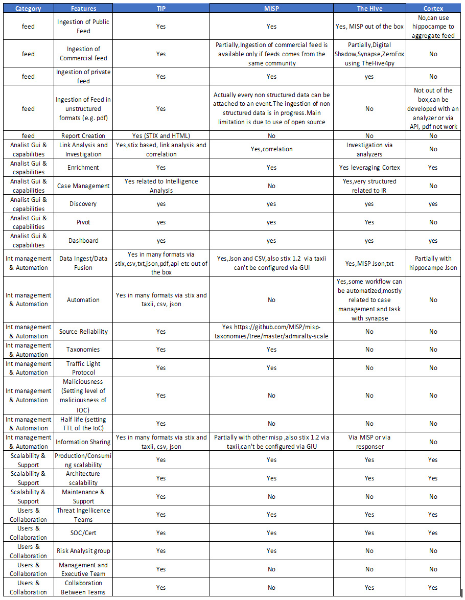
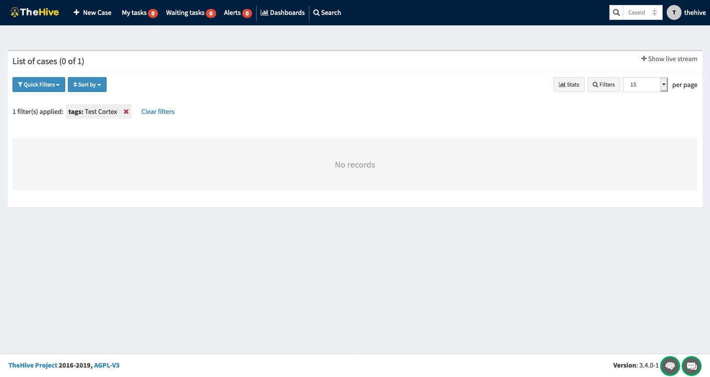
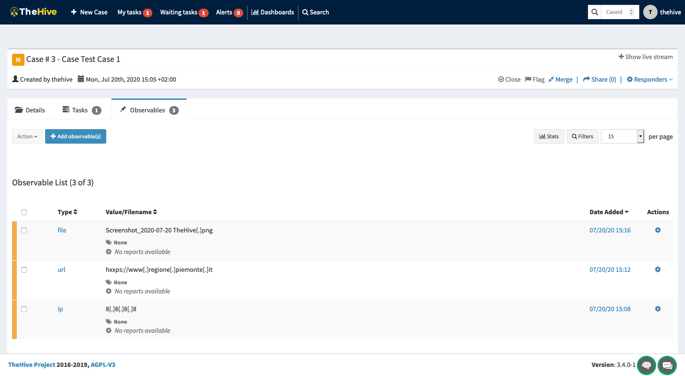
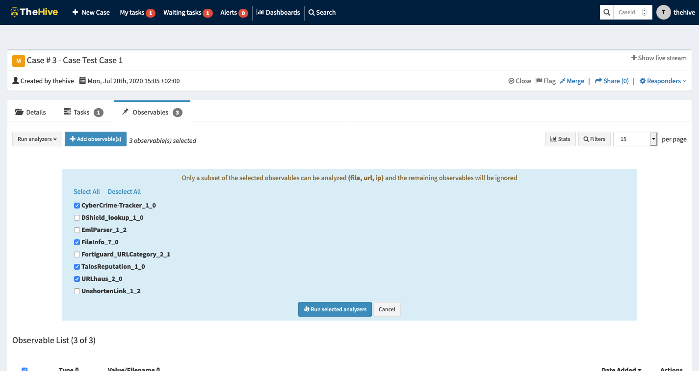
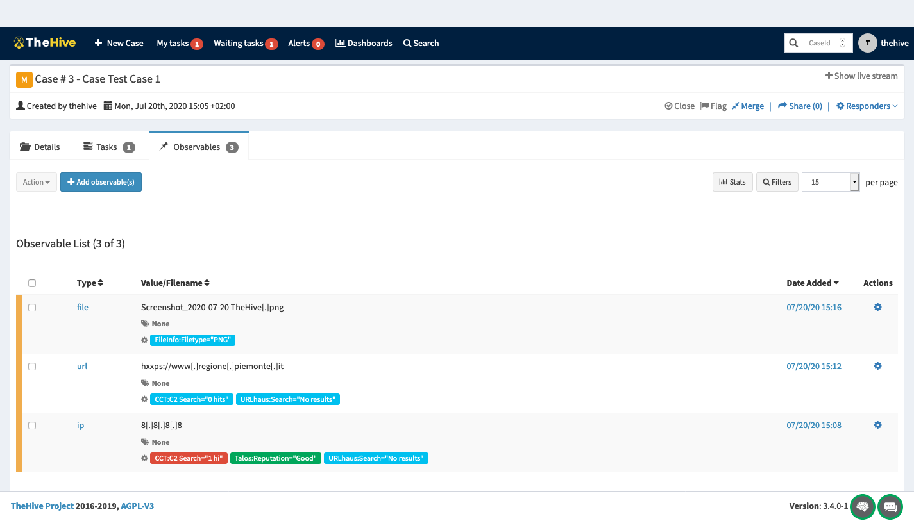
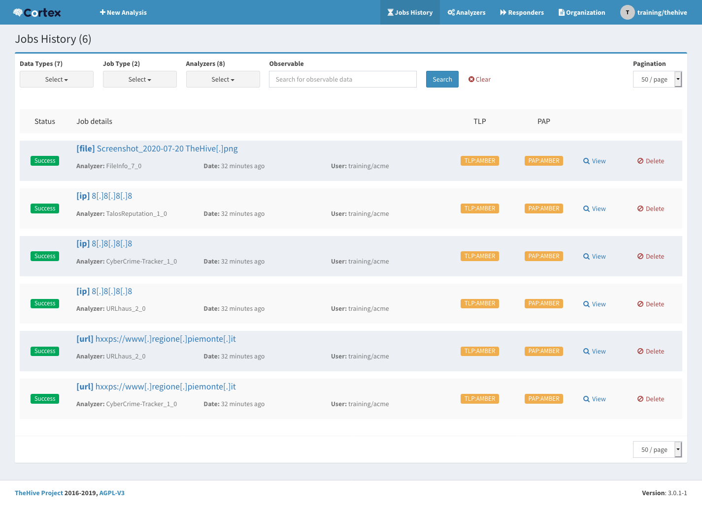
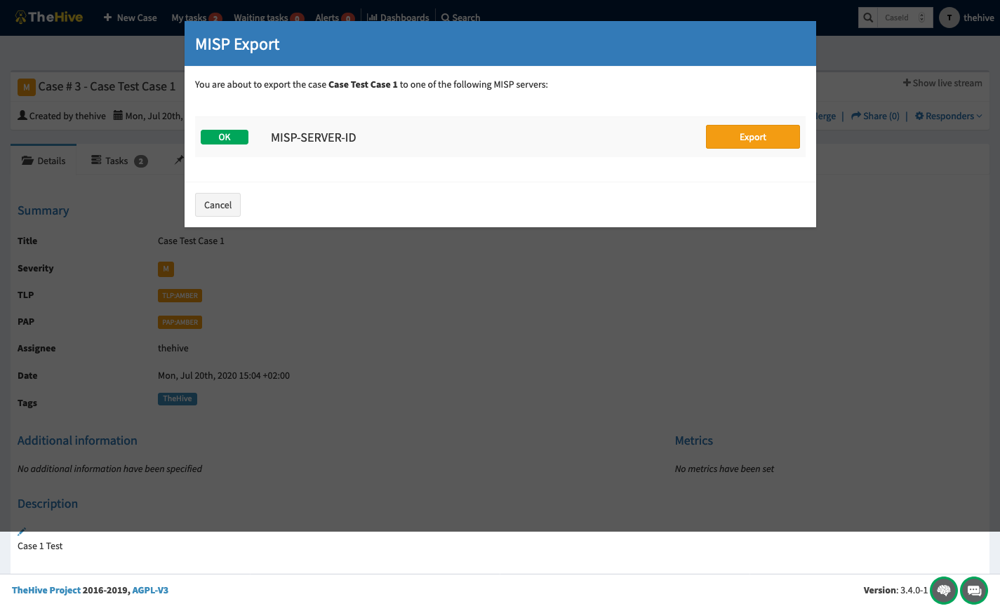
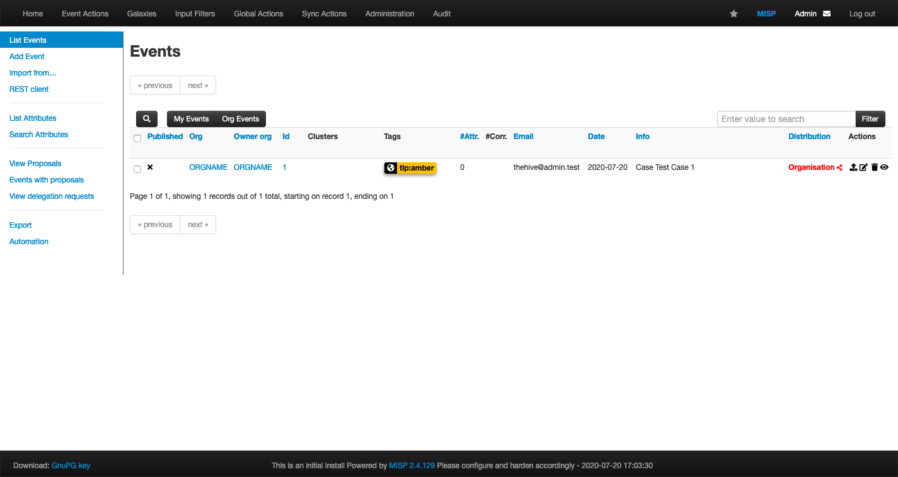
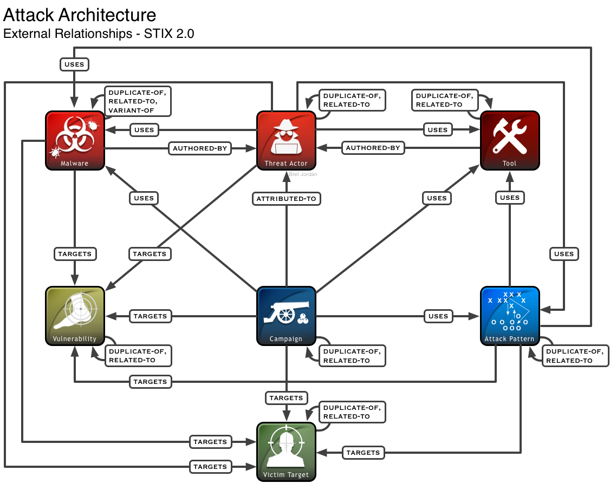
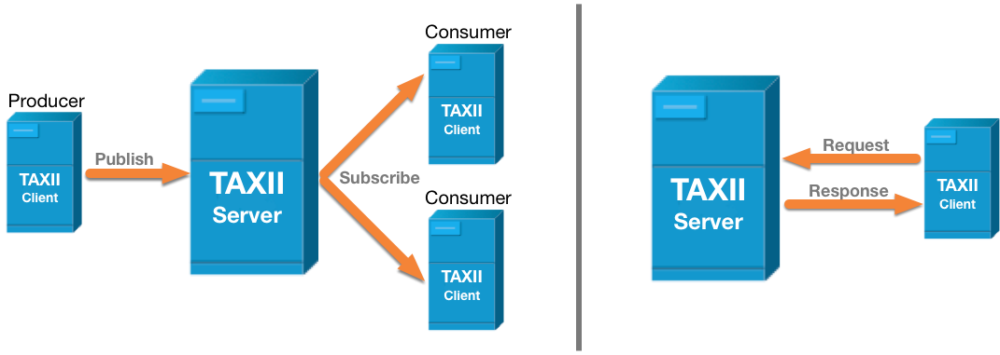
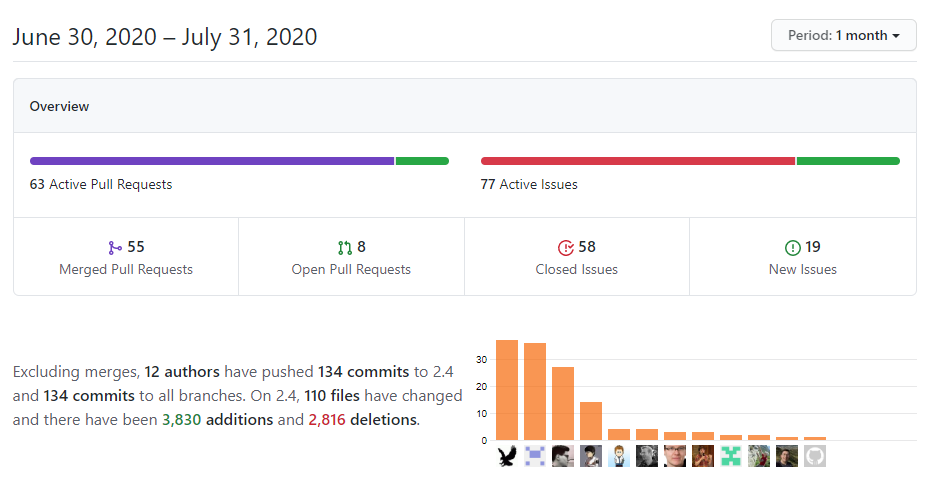
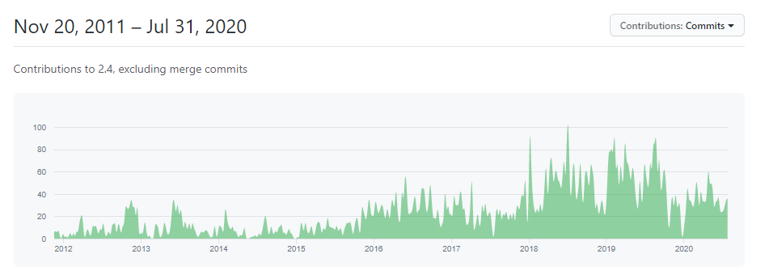
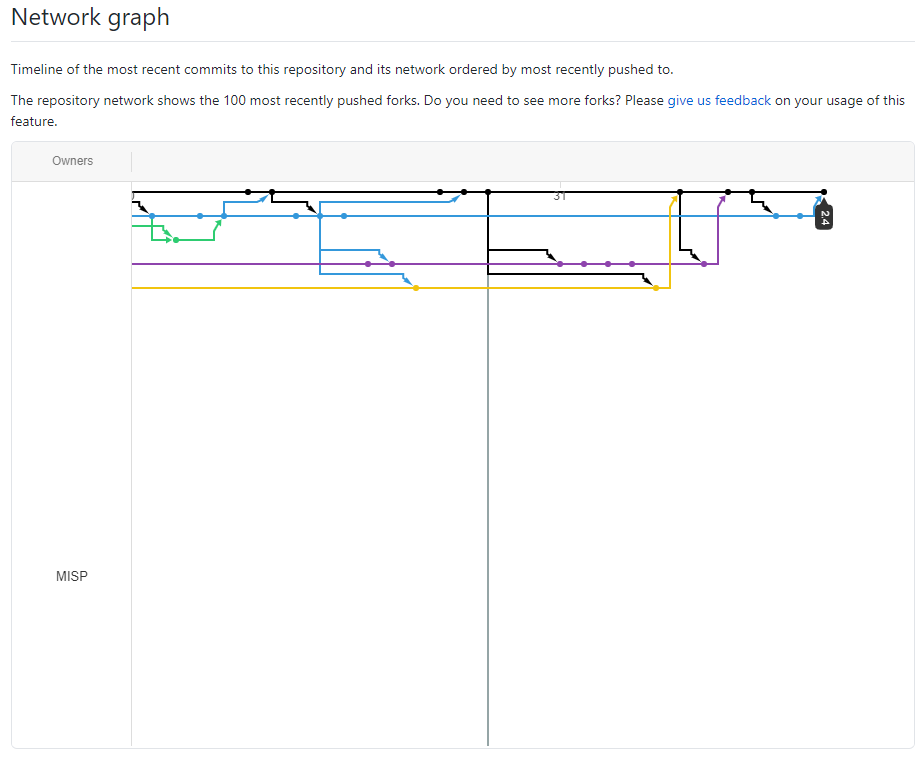
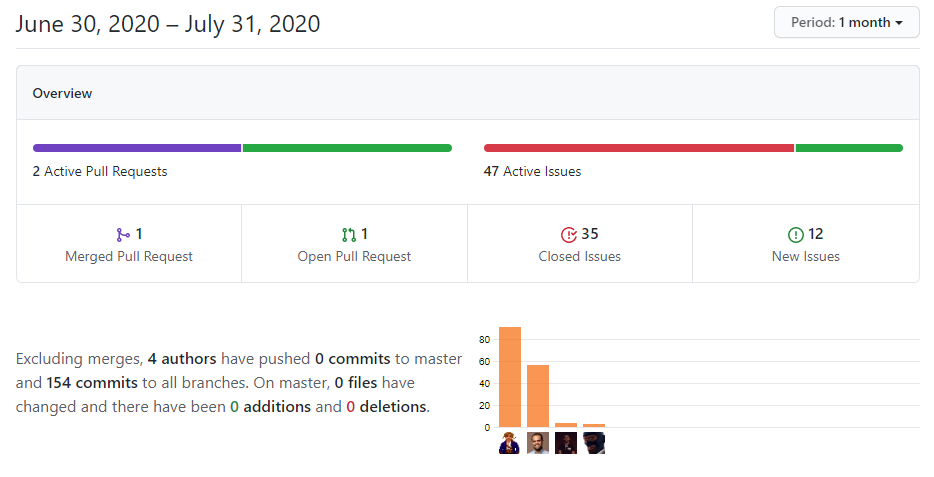
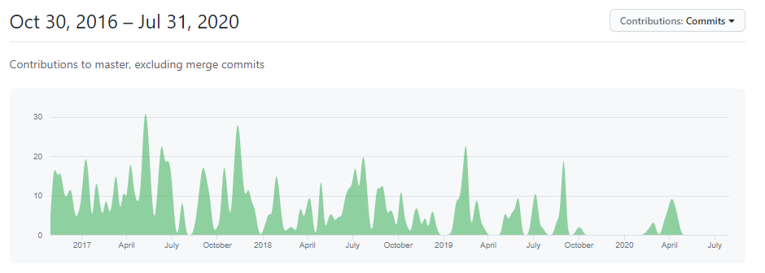
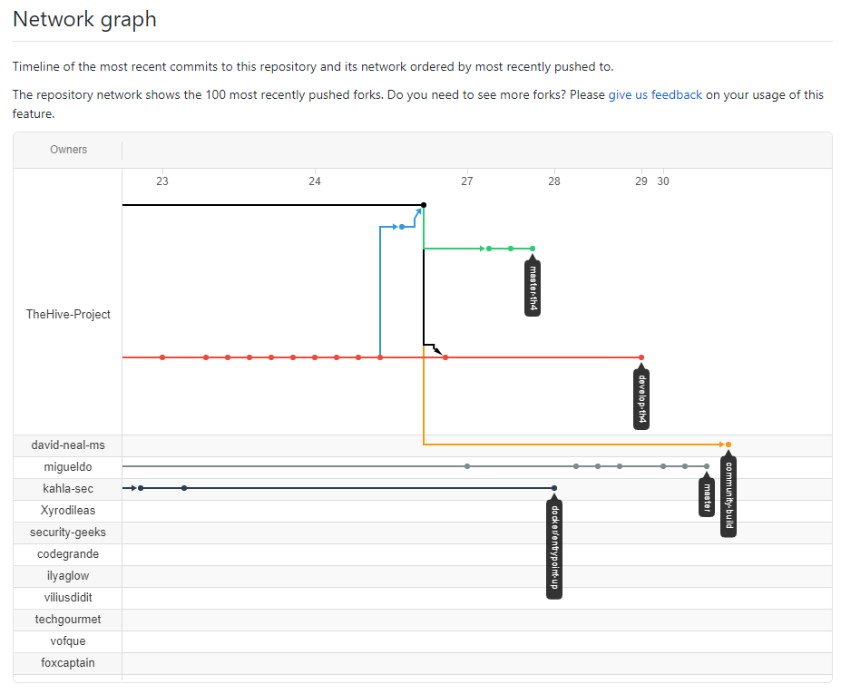
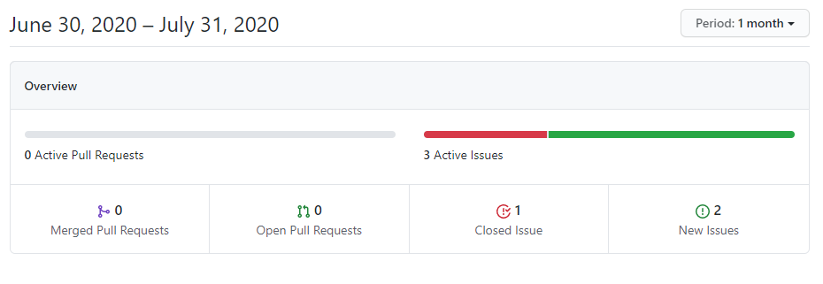
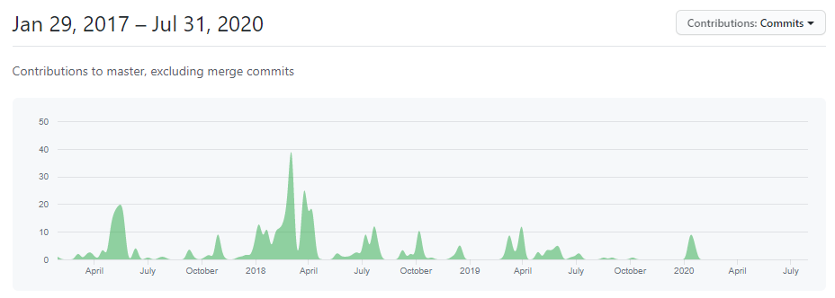
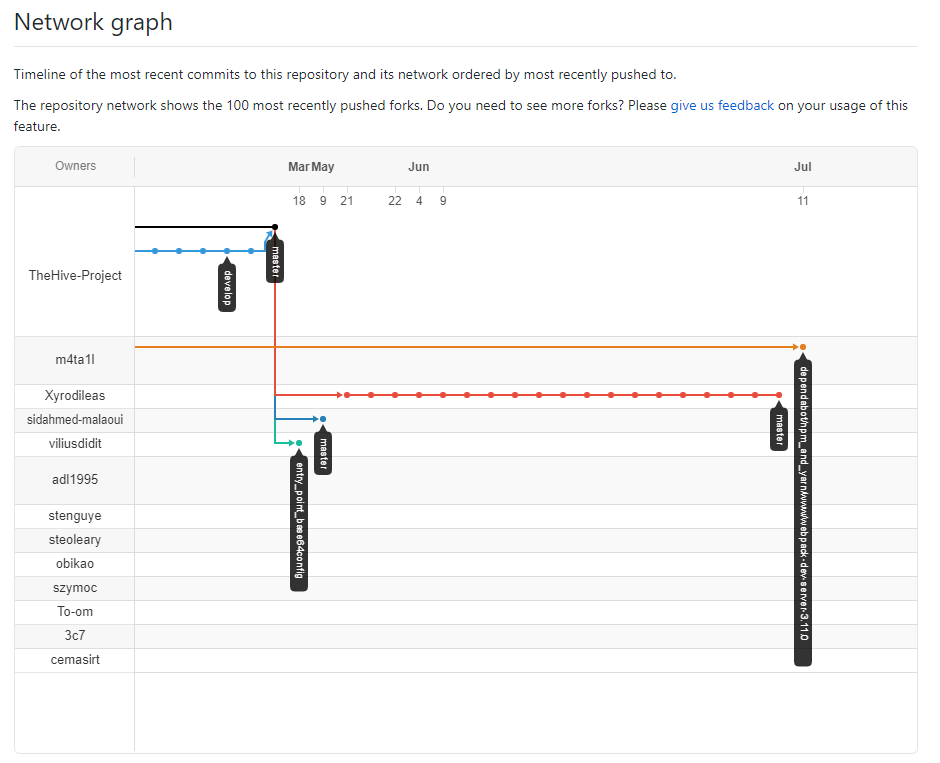
